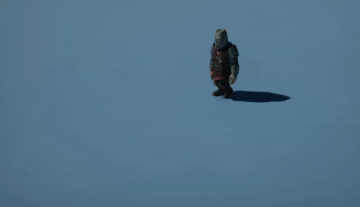
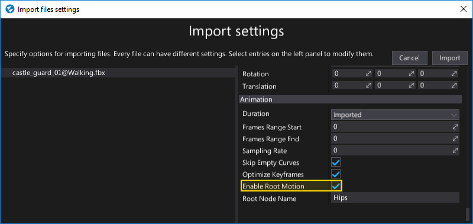
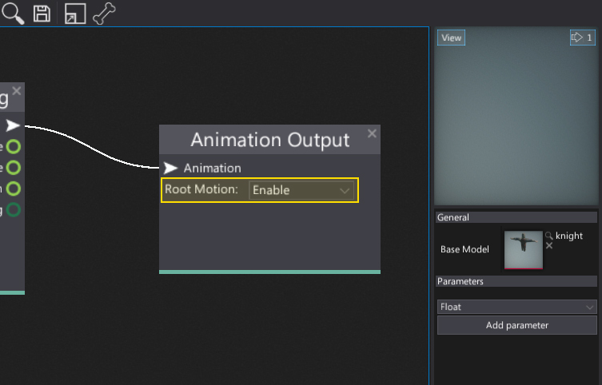

# Root Motion

**Root Motion** is a special feature of the Flax animation system that can be used to extract the motion from the animated model root node and apply it to the actor. This is useful, for example, to create animation-driven characters. Flax supports extracting root motion from the custom node and motion blending so it's possible to achieve realistic looking results.

| No root motion | Root motion enabled |
|--------|--------|
|  |  |

## Usage

In order to use root motion you need to:

1. Enable root motion when importing an animation

	

2. Enable root motion extraction and apply in Anim Graph

	

## Tips

You can manually specify the root node for the motion extracting when importing the animation. Use **Root Node Name** field (more info [here](../../graphics/models/import.md)).

If your character uses [Character Controller](../../physics/character-controller.md) or kinematic [rigidbody](../../physics/rigid-bodies.md) you may want to apply the root motion to it instead of to animated model. To do this simply assign the target object to [AnimatedModel.RootMotionTarget](https://docs.flaxengine.com/api/FlaxEngine.AnimatedModel.html#FlaxEngine_AnimatedModel_RootMotionTarget).

