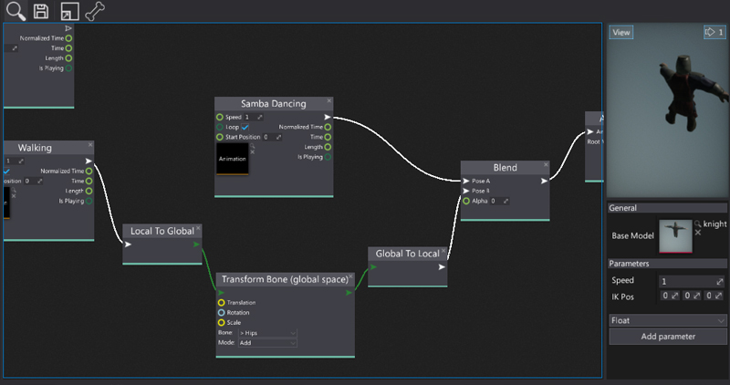
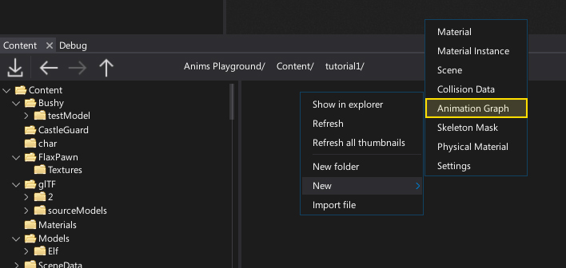

# Anim Graph

**Anim Graph** asset is used to define the skinned model animation playback logic. It allows to blend the unlimited amount of animations, perform custom bone transformations or advanced animation state machines. The only limit here is your creativity as anim graph editor can be a very powerful tool in right hands. It is one of the key elmenets of the Flax animation system.

This documentation section explains the basics and shows how to create and use the Anim Graph. Follow these documentation pages to create your very own character with lifelike animations and behavior.

## In this section

* [Editor Interface](interface.md)
* [Graph Parameters](parameters.md)
* [State Machines](state-machine.md)
* [Custom Ndes](custom-nodes.md)

## Creating Anim Graph

The first step is to create a new asset. It's a binary file and contains the nodes graph data as well as a set of graph parameters description. To learn how to do it see the dedicated step-by-step tutorial [How to create Anim Graph](../tutorials/create-anim-graph.md).

## Using Anim Graph

The next step is to edit and use the animation graph. You can see how to do it in [How to use Anim Graph](../tutorials/use-anim-graph.md) tutorial.

## Edit Anim Graph parameters

Finally, if you want to access and change the Anim Graph parameter values from the **C# code** you can see the dedicated [step-by-step tutorial](../tutorials/change-anim-graph-param.md) where you can learn how to do it.

## Bone Transformations

In Anim Graph skeleton nodes transformations are stores in an array of matrices in **local space** of the parent node.
Some nodes (eg. Inverse Kinematics) operate in **model space** which is defined as local space of the actor (Animated Model that runs the animation playback).
