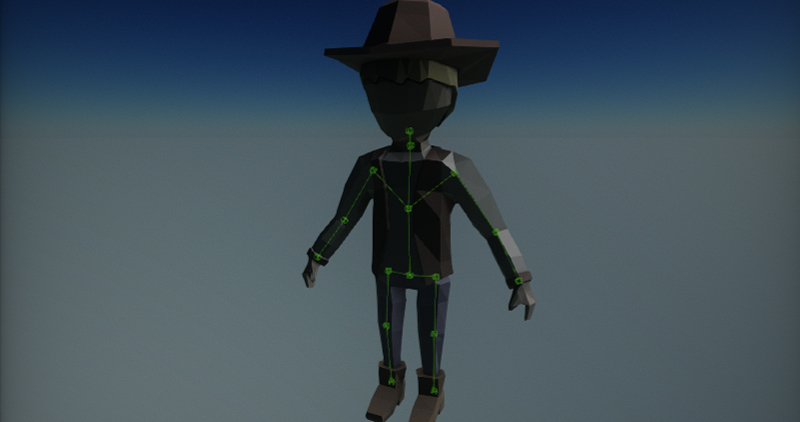
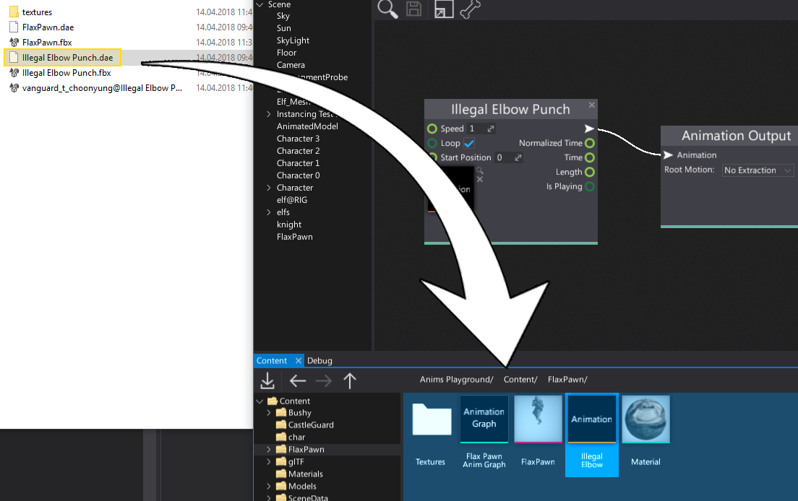
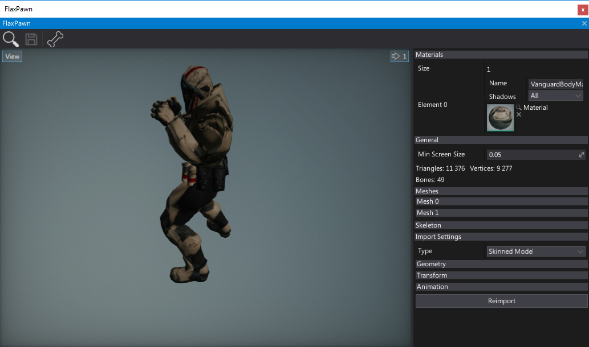
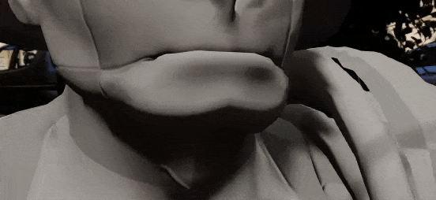

# Skinned Model

**Skinned models** are [models](../../graphics/models/index.md) that have been skinned to match the skeleton bone hierarchy. The rigged model contains a skin information that describes how mesh vertices are transformed when the model moves.

Skinned models after importing contain a skeleton. **Skeleton** is a structure that describes the deformation pattern of the skinned model. You can think about it as a human skeleton made of bones. Each bone has a parent bone. When parent bones change their position, they also affect the positions of child's bones. For example, a hand bone might have five child bones (the fingers and thumb); when the hand moves up and down, the fingers and thumb move with it.

## Importing skinned model

Importing skinned models works in the same way as for other asset types. Simple drag and drop the model files from *Explorer* into the *Content* window or use the *Import* button.

After choosing the files **Import file settings** dialog shows up. It's used to specify import options per asset. In most cases the default values are fine and you can just press the **Import** button. Remember to set the imported model type to **Skinned Model**, otherwise, it will be imported as a static model asset.

> [!Note]
> Using **Import file settings** dialog you can select more than one asset at once (or use **Ctrl+A** to select all) and specify import options at once.

Every asset can be reimport (relative path to the source file is cached) and import settings modified using Animation Window.

To learn more about **Import Options** see [Models Importing page](../../graphics/models/import.md).

> [!Note]
> Flax during importing separates the skeleton bones (used for the skinning) and the skeleton nodes hierarchy due to performance reasons (there are fewer bones that are used for rendering). If your model used sockets or any dedicated nodes they may be lost. However, it's better to use the Bone Socket actor in Flax.

Flax supports **Level of Detail** for skinned models including automatic generation on import.

## Editing skinned model

To view and edit the imported skinned model asset double-click on it in *Content* window.
You can edit the default material slots or quickly reimport the asset from the source file. That window contains also various debugging tools such as skeleton [bones debugging](../advanced/bones-debugging.md) and meshes info panels.
To learn more about editing the skinned model properties and exploring it see the [window interface](interface.md) page.

## Using skinned model

Skinned models are used by the many parts of the animation system.
The most important usage is to feed the rendering system with the meshes data.
Also assets like [Anim Graph](../anim-graph/index.md) and [Skeleton Mask](../skeleton-mask.md) are using the skeleton bones structure indiced within the skinned model asset. You can also access the skeleton data via C# scripting API (see [SkinnedModel](https://docs.flaxengine.com/api/FlaxEngine.SkinnedModel.html) class).

## Blend Shapes

Flax supports importing and using Blend Shapes (aka. morph targets) for skinned models. This can be useful to implement character face emotions or lip sync during dialog scenes. When importing asset check **Import Blend Shapes** option. Then you will be able to preview the blend shapes in the skinned model window (each channel is adjustable under *Blend Shapes* group).
Then you can control blend shapes appearance at runtime from code using [AnimatedModel](https://docs.flaxengine.com/api/FlaxEngine.AnimatedModel.html) class methods *SetBlendShapeWeight* / *GetBlendShapeWeight* / *ClearBlendShapeWeights*.

