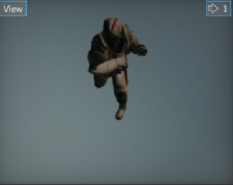

# Skinned Model Window Interface

The skinned model editor window UI consists of a toolstrip, viewport and properties panel.

1. Toolstrip
2. Properties Panel
3. Viewport

## Toolstrip

The following table lists the options in the toolstrip and what they do.

| Icon | Description |
|--------|--------|
|  | Shows and selects the asset in the *Content* window |
|  | Saves the asset to the file |
|  | Shows the skeleton bones hierarchy |

## Viewport

The viewport panel shows the preview of the asset.

You can navigate in the viewport by using the **right mouse button** or zoom in/out by pressing right mouse button and using **mouse scroll wheel**.

Like all viewports in editor, this one also comes up with a *View* widget menu. By pressing that button you can debug material channels, preview different view modes or even change camera field of view angle. To learn more about using the editor viewports and related tools please read [debugging tools](../../graphics/debugging-tools/index.md) page.

## Properties panel

This panel shows:
* Material Slots properties
* General model info
* Meshes editing tools (eg. material slot binding)
* Skeleton bones hierarchy preview
* Import settings (for quick asset reimport)

You can use it to modify the asset, view the model info (triangles, vertices, bones amount), or reimport it from the source asset. Because this panel contains a lot of content it has been split into several groups so by clicking on a given group header bar (eg. *Skeleton*) it will pop up its contents.

