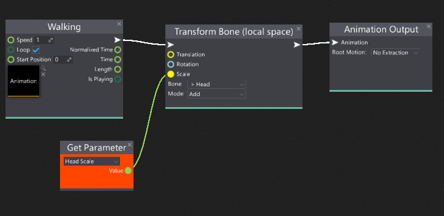
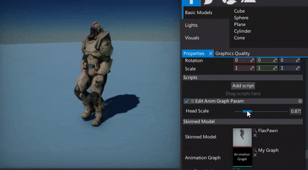

# HOWTO: Change Anim Graph parameter from code

In this tutorial you will learn how to create and access the [Anim Graph](../anim-graph/index.md) parameter using the C# script. You can think about the graph parameters as public variables of the graph which can be modified from outside to configure the logic. For example, you can create a parameter called **Speed** and use it to blend between *Run* and *Walk* animations fo your character to implement the proper animation playback for your game.

## 1. Create Anim Graph


Firstly prepare your Anim Graph asset. To learn how to setup one see the related tutorial [How to create Anim Graph](create-anim-graph.md).

## 2. Add graph parameter


Now add one or more graph parameter. To do it simply specify the parameter type (with combo box menu) and click the **Add parameter** button. It will add a new parameter. You can rename or remvoe the created parameters by using the dedicated context menu. Simply right click on a parameter name label. You can also specify the default value for the parametrs.


## 3. Use graph parameter

Next step is to access this parameter in the graph. To do it simply spawn the **Get Parameter** node and then select your parameter from the dropdown menu.


After that connect your parameter outputs with the other nodes to implement the desired usage. In this example, the **Head Scale** parameter is used to scale the skeleton bone using the **Transform Bone (local space)** node. Note that Anim Graph supports implicit type casting so the value type **float** gets converted into the **Vector3** type which is used for the bone transformation scale.



## 4. Set graph parameter from C# #

In the following code sample, the graph script gets the animated model parameter and sets the value. You can cache the graph parameters, iterate over them and access from any part of your code.

```cs
using FlaxEngine;

public class EditAnimGraphParam : Script
{
	[Range(0.5f, 2.5f)]
	public float HeadScale  = 1.0f;

	private AnimationGraphParameter _parameter;

	public void Start()
	{
		// Cache the parameter handle
		_parameter = Actor.As<AnimatedModel>().GetParam("Head Scale");
	}

	public void Update()
	{
		// Update the value
		_parameter.Value = HeadScale;
	}
}
```

## 5. See the results

Here is the example usage that scales the character head bone.


