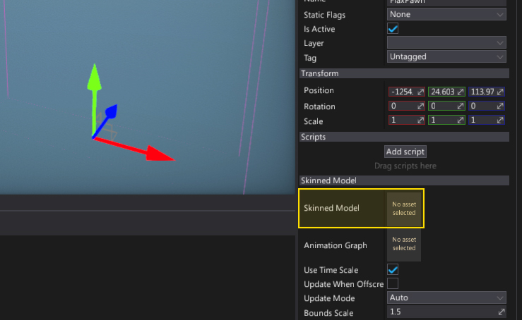
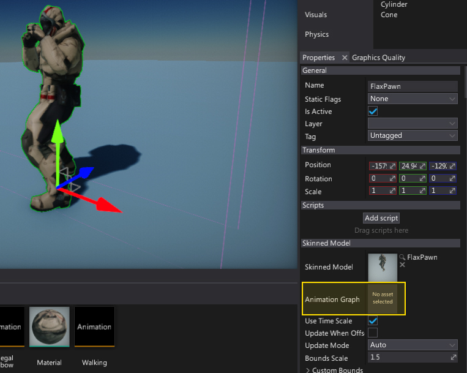

# HOWTO: Setup animated model

In this tutorial you will learn how to create and use the Animated Model actor in your game.

## 1. Add Animated Model actor


Next step is to create [Animated Model](../animated-model.md) actor to your scene.
This type of actor is using the skinned model asset and animation graph to update animation and render the skinned model.
There are several ways to create one. You can spawn it from C# script at runtime, add it to the scene with Scene Tree window context menu or simply **drag and drop the skinned model asset into the editor viewport**.


## 2. Link the Skinned Model



After spawning the animated model it will link the skinned model for rendering but you can modify it manually by setting the **Skinned Model** property. Simply select the actor and drag and drop the skinned model asset into the asset picker control.

## 3. Link the Anim Graph



Next step is to assign the [animation graph](../anim-graph/index.md) to it so the animation can be updated every frame. Again, drag and drop the anim graph asset into the **Animation Graph** property.

## 4. See the results


Finally, simply press the **Play** button or hit **F5** button. You should see your animation being played.

## Spawn animated model from code

Here is a sample script that spawn the animated model actor when user clicks the left mouse button.

```cs
using FlaxEngine;

public class SpawnAnimModel : Script
{
	public AnimationGraph AnimGraph;
	public SkinnedModel Model;

	public override void OnUpdate()
	{
		if (Input.GetMouseButtonDown(MouseButton.Left))
		{
			var actor = new AnimatedModel();
			actor.Name = "My animated model";
			actor.SkinnedModel = Model;
			actor.AnimationGraph = AnimGraph;
			Level.SpawnActor(actor);
		}
	}
}
```
