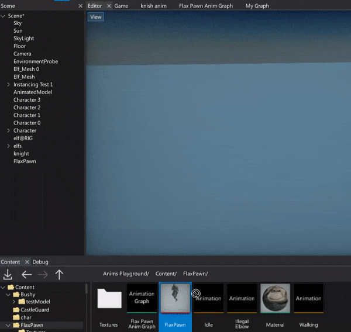
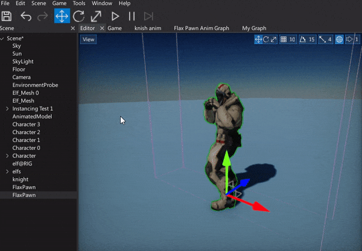

# HOWTO: Use Anim Graph

In this tutorial you will learn how to use the Anim Graph asset to render the animated model in your game.

## 1. Create Anim Graph

Firstly prepare your Anim Graph asset. To learn how to setup one see the related tutorial [How to create Anim Graph](create-anim-graph.md).

## 2. Add Animated Model actor

Next step is to create [Animated Model](../animated-model.md) actor to your scene.
This type of actor is using the skinned model asset and animation graph to update animation and render the skinned model.
There are several ways to create one. You can spawn it from C# script at runtime, add it to the scene with Scene Tree window context menu or simply **drag and drop the skinned model asset into the editor viewport**.

## 3. Link the Anim Graph

After spawning the animated model it will link the skinned model for rendering but you also need to assign the animation graph asset created earlier. Select the actor and assign the property value.

## 4. See the results

Finally, simply press the **Play** button or hit **F5** button. You should see your animation being played.
