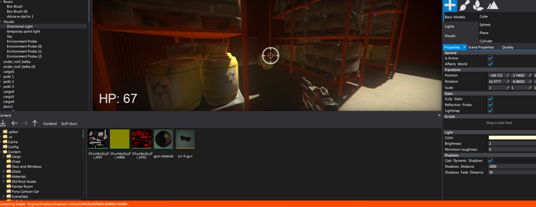
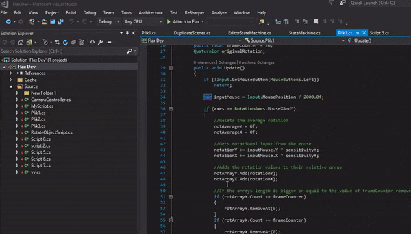

# Play In-Editor

One of the main Editor features is **play in-editor** mode.
In this mode editor loads scenes and performs a full game simulation.
It's the fastest way to test your gameplay and debug scripts logic.
The editor tries to recreate the same environment for the game as in standalone game except your can still modify the scenes, objects and even pause the gameplay.
Using this feature is one of the essential parts of the game development with Flax.

## Testing game in editor

The simplest way to play your game in the editor is to hit **F5** button or use a [Toolbar](windows/toolbar.md) **Play** button. To launch the simulation at least one scene has to be opened. Editor will reload it and start the game.

As soon as you game starts you can easily debug scripts and inspect the objects. To learn more about scripts development and debugging see [Scripts debugging](../scripting/debugging/index.md) page.

## Useful tips

* To end the play mode simply hit *F5* key again or press the toolbar *Stop* button
* One or more scenes has to be loaded to start the simulation
* Editor will recompile scripts before launching game (if not disabled in editor options)
* Loaded scenes will be serialized and loaded when entering the simulation
* Initial state will be restored after simulation end (including unsaved changes to actors)
* No undo/redo support in play mode
* Scenes cannot be saved in play mode
* Use *Shift+F11* to unlock the mouse in [Game window](windows/viewport.md) if your game locks the cursor
* Loading/unloading scenes from code works the same as in builded game (editor will show the current scene hierarchy)

