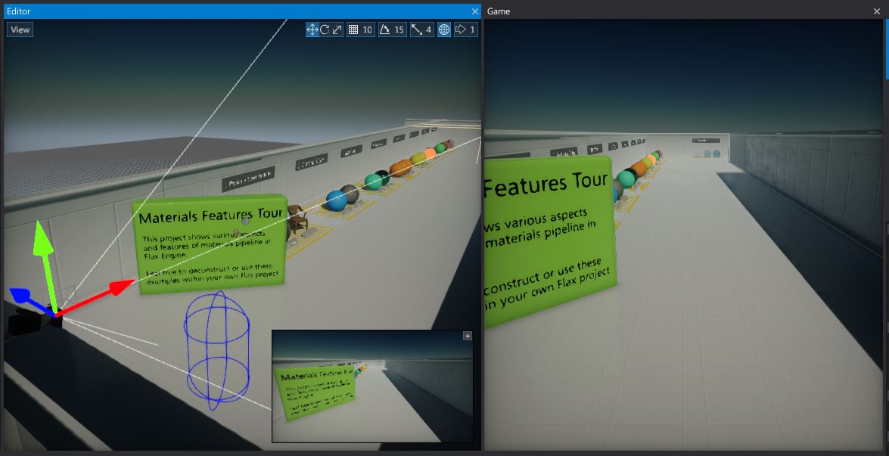
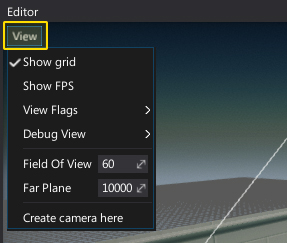

# Viewport

**Viewport** term refers to **Editor Window** and **Game Window**.
Both are used to preview the level.
* **Game** window - shows the current game camera view with GUI and game input controls logic
* **Editor** window - allows to navigate camera through the level, select, transform and edit scene objects

## Editor window

The Editor Window is an interactive view into your level.
You can select objects using it and navigate through the scene.

#### Widgets

Editor viewport contains set of widget buttons. In the upper left corner it has a *View* button that allows you to change the current viewport properties, debug rendering or spawn a new camera actor.

In the upper right corner there is set of widget buttons to control the transform gizmo and viewport camera speed.
To learn more about using a transform gizmo see [this page](../../get-started/scenes/transforming-actors.md).

### Controls

| Action | Description |
|--------|--------|
| **LMB** | Select object |
| **Ctrl + LMB** | Add/remove object from selection |
| **RMB** | Rotate camera |
| **RMB + Arrows/WSAD** | Move camera |
| **RMB + MMB** | Move camera |
| **MMB** | Pan camera |
| **LMB + Mouse Wheel** | Zoom in/out |
| **Alt + LMB** | Orbit camera (around last viewed object center, translated) |
| **F** | Show selected actor (focus on it) |
| **Delete** | Delete selected objects |
| **1** | Set gizmo mode to *Translate* |
| **2** | Set gizmo mode to *Rotate* |
| **3** | Set gizmo mode to *Scale* |

Also, all key shortcuts related to level editing windows (viewport, scene window, properties, etc.) are available. For instance, use **Ctrl + S** to ave all changes.
Note: some input configuration can be changed via Editor Options.

## Game window

The Game Window is rendered from the camera(s) in your game.
It is representative of your final, builded game during in-editor simulation.
You will need to use one or more cameras to control what the player actually sees when they are playing your game.
