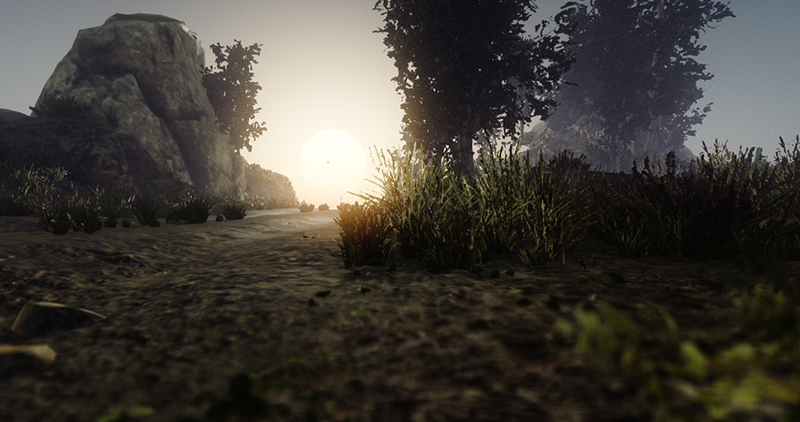

# Foliage

Flax supports high-quality foliage rendering and provides various tools for creating and editing foliage. It enables you to create realistic looking outdoor scenes full of trees, bushes, rocks, and grass. Use this documentation section to learn how to create your foliage and edit it to create a great visual experience.

## Foliage Details

Foliage actor contains a list of predefined *foliage instance types* and a collection of *foliage instances*. Each foliage type defines the model asset to use for rendering, placement properties, and painting properties. Each foliage instance contains information about what type it uses and the actual placement transformation in the world. Both instances and types collections are encapsulated inside the foliage actor internally to improve performance.

## In this section

* [Foliage Types](types.md)
* [Foliage Editing](editing.md)
* [Foliage Density Scaling](density-scaling.md)

## Tutorials

* [How to create foliage](tutorials/create-foliage.md)
* [How to create foliage from code](tutorials/foliage-from-code.md)

## Foliage System Implementation

Foliage internally uses **Quad Tree** structure to achieve great performance in scenes that use more than 200k instances. Quad tree clusters are on scene load or after modifications. Flax supports various tools to optimize the game content such as foliage density scaling, cull distance, LOD bias and minimum screen size per model LOD.

For small grass and rocks, it is recommended to use density scaling. By adjusting `Foliage.GlobalDensityScale` you can apply the global foliage density scale factor and reduce the amount of visible instances using the random pattern. Use it to tweak game performance for slower devices. To learn more about adjusting foliage performance see [this page](density-scaling).

