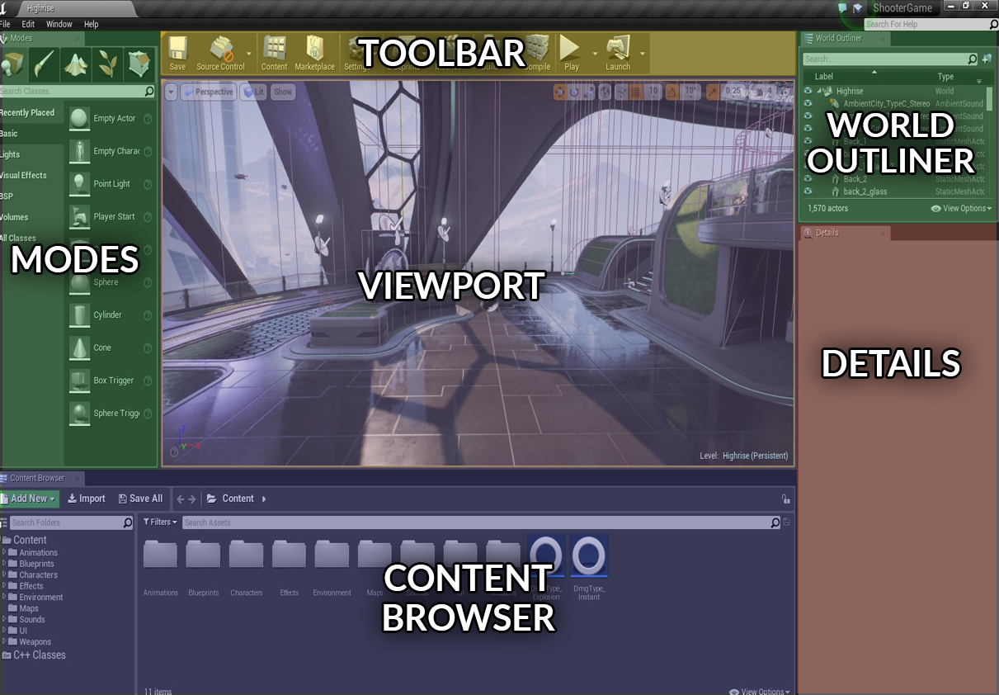
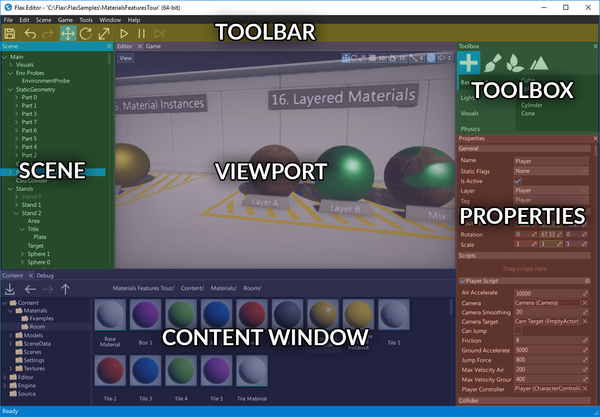

# Flax for UE4® developers


Flax and Unreal have many similarities (materials pipeline, physics engine) and share many concepts, however there are a few differences. This page helps Unreal Engine 4 developers to translate their existing experience into the world of Flax Engine.

> [!Warning]
> Warning! Once you switch from Unreal to Flax you will love this engine!

## Editor

Flax Editor and Unreal Editor are very similar. You can see the color-coded, highlighted areas on screenshots of both editors that have common functionalities. Flax Editor layout is also highly customizable so you can drag and drop windows around to adapt the editor to your workflow.





> [!TIP]
> With Flax Editor, you don't have to wait for 15 minutes before the project opens like in UE4. We are sorry that you had to waste so much time.

## Terminology

This section contains the most common terms used in UE4 and their Flax equivalents (or rough equivalent). Flax keywords link directly to more in-depth information inside the documentation.

| Unreal | Flax |
|--------|--------|
| **Actor** | [Actor](../scenes/actors.md) |
| **Blueprint** | [Script](../../scripting/index.md) |
| **C++** | [C#](../../scripting/index.md) |
|||
| **World Outliner** | [Scene Window](../../editor/windows/scene-window.md) |
| **Details Panel** | [Properties Window](../../editor/windows/properties-window.md) |
| **Content Browser** | [Content Window](../../editor/windows/content-window.md) |

## Project


Flax projects structure is similar to UE4 projects. The editor uses **Cache** folder to keep temporary data. Also, **Content** folder works the same way as in Unreal (assets-only), while **Source** directory is used to keep all C# scripts.

Flax also generates a solution and project files for your game C# scripts.

See [Flax projects structure](../project-structure.md) page to learn more about the projects in Flax Engine.

## Assets

Flax also uses binary asset files with extension `.flax` (instead of `.uasset`). We are using our own binary format that is well optimized for scalability and streaming. Other assets are usually stored in json format (scenes, settings, etc.).

Flax supports the most popular asset files formats (for 3D models and textures) so you can import your game content.

See [Assets](../assets/index.md) page to learn more about importing and using game assets.

## Scenes and Actors

Flax doesn't use components to build scene objects logic. We only use [Actors](../scenes/actors.md). Each Actor has its own type (e.g. point light, box collider) and a collection of attached scripts. This means, in Flax the scene object hierarchy is created with Actors.

However, you can still use the entity-component design with your scripts because every actor can have scripts.
You can use `GetChild<T>()`/`GetScript<T>()` methods in your scripts to access the other objects.

In Flax, Scene object is also an Actor so you can access it like any other Actor. This means that Scenes can have their own scripts and be transformed like other objects.

## Scripting

When it comes to game scripting, there is a significant difference between Unreal and Flax.
Firstly, we use C# language to write game code (instead of C\+\+).
Using C# helps with rapid game development and simplifies the development.
The Flax Engine itself is written in C++ so you don't have to worry about the performance.

You can create C# files with script classes that provide a gameplay logic. Then scripts can be attached to the actors and used in a game. Our scripting C# API is an open-source project and can be found [here](https://github.com/FlaxEngine/FlaxAPI). All contributions are welcome.

Here is an example script that has been written for Unreal and Flax which prints the next number every frame.

* Unreal

```cpp
#pragma once
#include "GameFramework/Actor.h"
#include "MyScript.generated.h"

UCLASS()
class AMyScript : public AActor
{
	GENERATED_BODY()
	int Count;

	AMyScript()
	{
		// Allows Tick() to be called
		PrimaryActorTick.bCanEverTick = true;
	}

	void BeginPlay()
	{
		// Called when the game starts or when spawned
		Super::BeginPlay();
		Count = 0;
	}

	void Tick(float DeltaSeconds)
	{
		// Called every frame
		Super::Tick(DeltaSeconds);
		GLog->Log(FString::FromInt(Count++));
	}
};
```

* Flax

```cs
using FlaxEngine;

public class MyScript : Script
{
	int Count;

	void Start()
	{
		// Use this for initialization
		Count = 0;
	}

	void Update()
	{
		// Update is called once per frame
		Debug.Log(Count++);
	}
}
```

See [Scripting](../../scripting/index.md) documentation to learn more about C# scripts in Flax.

<hr>

Unreal and its logo are trademarks of Epic Games, Inc.
