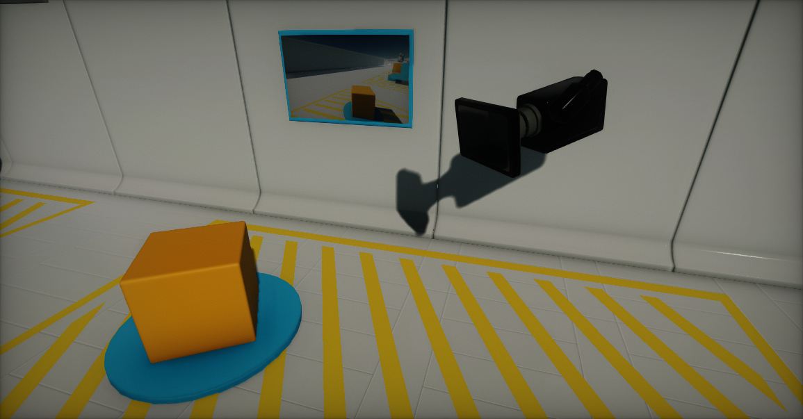
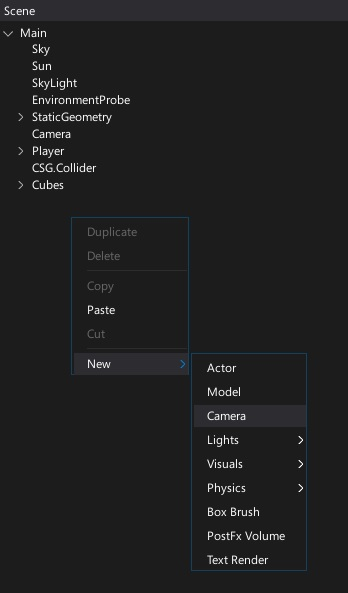
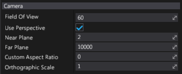
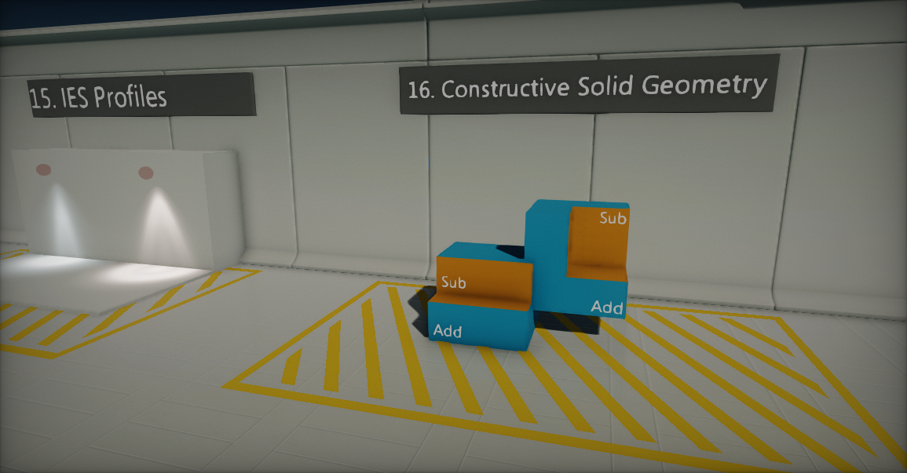
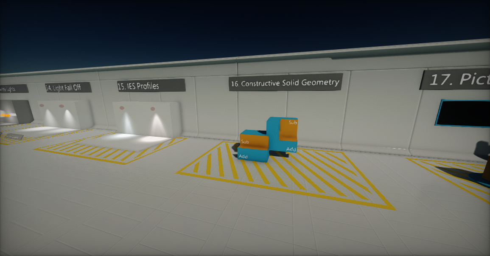
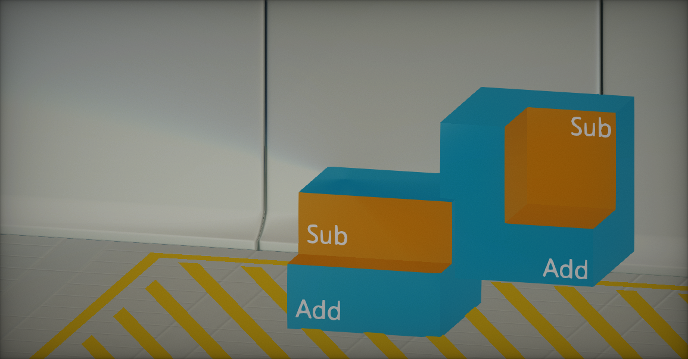
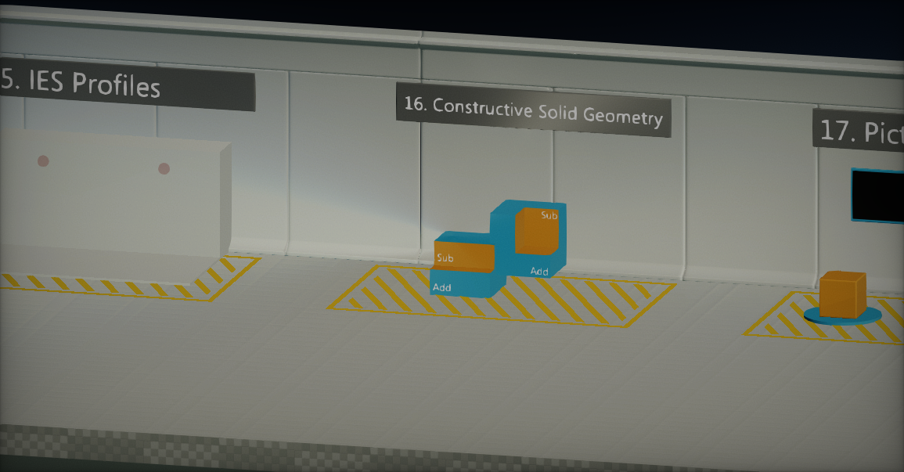
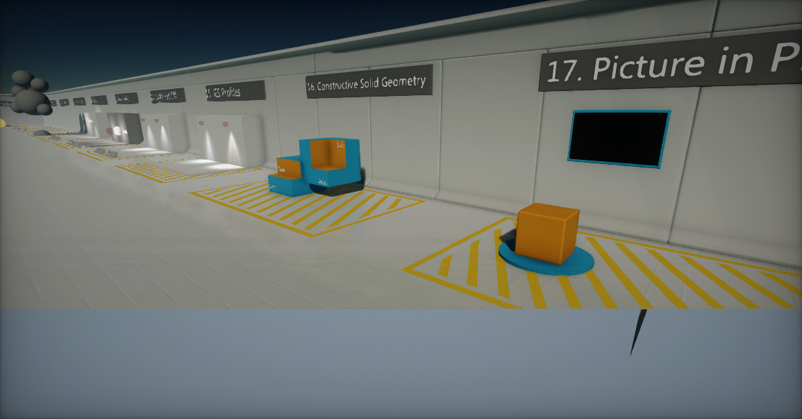
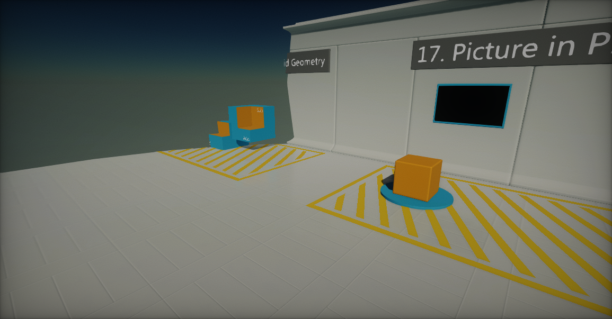

# Cameras



**Camera** captures the scene and displays it to the user. It defines a view in screen space. Camera's position and rotaton define the *viewport* and *view direction*. Those properties are used to render scene objects and preent them to the user.

Flax Engine allows to create unlimited amount of cameras in scene while the [main one](http://docs.flaxengine.com/api/FlaxEngine.Camera.html#FlaxEngine_Camera_MainCamera) is used for the final frame rendering.

## Creating camera in editor

In the *Scene* tree window, right-click and select **New -> Camera**.
Editor will create new Camera actor with default properties.



## Creating camera in script

The following sample code can be used to instantiate new camera object in a scene.

```cs
public class MyScript : Script
{
	void Start()
	{
		var camera = Camera.New();
		SceneManager.SpawnActor(camera);
		camera.Position = new Vector3(0, 100, 0);
	}
}
```

To learn more about the C# scripting API see [Camera](http://docs.flaxengine.com/api/FlaxEngine.Camera.html) class.

## Camera properties



| Property | Description |
|--------|--------|
| **Field Of View** | The vertical field of view (in degrees) used for perspective projection. |
| **Use Perspective** | If checked, camera will use perspective projection, otherwise orthographic. |
| **Near Plane** | The nearest point the camera can see (near clipping plane). |
| **Far Plane** | The furthest point the camera can see (far clipping plane). |
| **Custom Aspect Ratio** | Custom aspect ratio you specify. Otherwise, automatically adjust the aspect ratio to the render target ratio. Use value 0 to disable it. |
| **Orthographic Scale** | Additional scale used for the orthographic projection size. This has the effect of zooming in and out. |

## Perspective and orthographic cameras

Camera objects can work in two modes: perspective and orthographic. Each mode uses different projection mapping method affect how rendered scene looks.

- **Perspective** camera provides a "real-world" perspective of the objects in your scene. In this view, objects close to the camera appear larger, and lines of identical lengths appear different due to foreshortening, as in reality. Perspective cameras are most used for games that require a realistic perspective, such as third-person and first-person shooters.

- **Orthographic** camera renders objects always in the same size, no matter their distance from the camera. Parallel lines never touch, and there's no vanishing point. Orthographic cameras are most used for games with isometric perspectives, such as some strategy or role-playing games.

## Field of view (perspective mode only)

If camera has checked value **Use Perspective**, then it will use perspective projection. The **field of view** changes the camera frustum, and has effect of zooming in or out of the scene. When using high value (90 or above), the field of view results in stretched "fish-eye lens' views.

| Field of view: 50 | Field of view: 80 |
|--------|--------|
|  |  |

## Orthographic scale (orthographic mode only)

If camera has unchecked value **Use Perspective**, then it will use orthographic projection. The **orthographic scale** changes the camera frustum size, and has effect of zooming in or out of the scene.

| Orthographic scale: 0.3 | Orthographic scale: 1 |
|--------|--------|
|  |  |

## Near and far planes

The near and far clipping planes are used to define the camera frustum begin and end points.
The near plane is the closest point the camera can see. All geometry that it in front of it won't be rendered.
The far plane is the furthest point the camera can see. It's also known as a draw distance or a view distance. All geometry that it beyond of it won't be rendered.

Adjusting near and far planes affects rendering precision and scene depth quality. Using too small near plane value (lower than 1) or very high far plane (higher than 100000) may result in depth precision issues as well as [Z-fighting](https://en.wikipedia.org/wiki/Z-fighting).

| Near plane: 300 | Far plane: 800 |
|--------|--------|
|  |  |

## Render a camera to a texture

Flax Engine offers very wide range of customization that can be made to extend the rendering pipeline. One of them is rendering scene using the custom camera right to the render target. Then presenting it on an object surface. To create such effect check out the tutorial: [How to render a camera to a texture](render-camera-to-texture.md).
