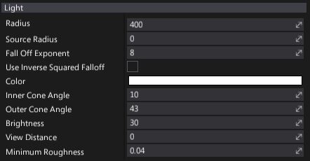
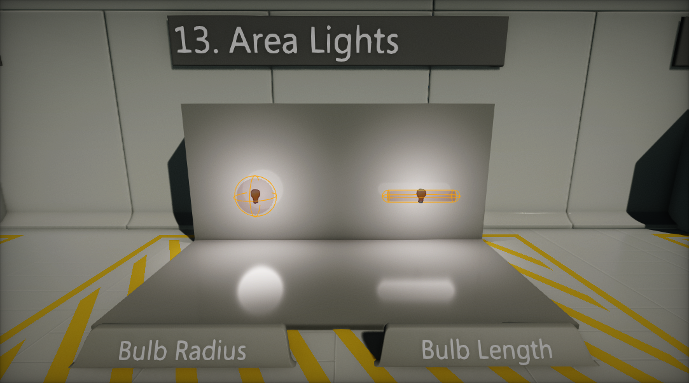
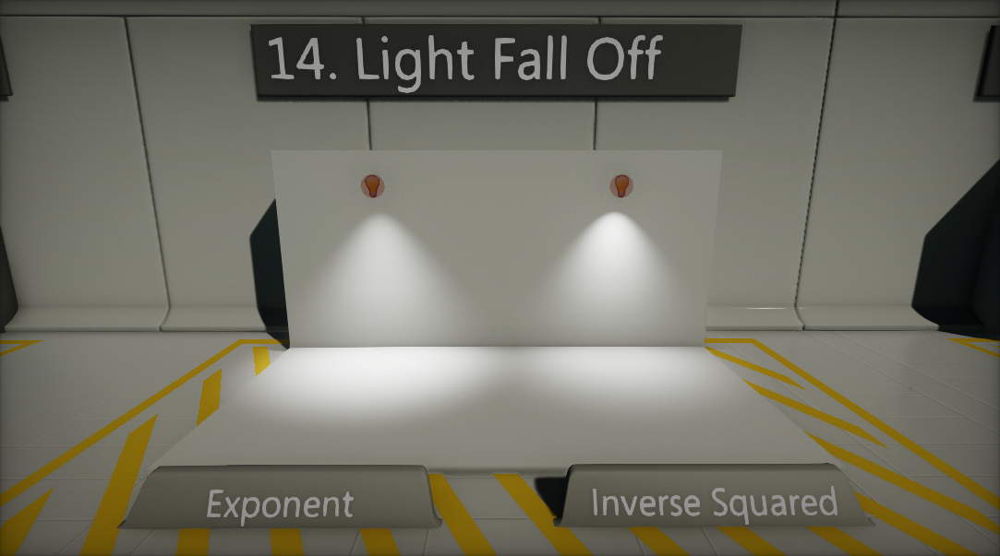
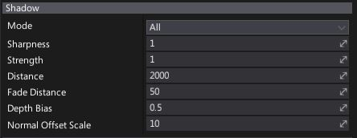

# Spot Light

**Spot Light** emits light from a single point in a cone shape in a specific direction. Spot Lights are useful for simulating light from objects such as lampposts and flashlights. By changing **Inner Cone Angle** and **Outer Cone Angle** you can modify the shape of the light.

## Light Properties

| Property | Description |
|--------|--------|
| **Radius** | Light range (in world units). |
| **Source Radius** | Light build source radius (in world units). |
| **Fall Off Exponent** | Controls the radial falloff of light. Works only if option *Use Inverse Squared Falloff* is disabled. |
| **Use Inverse Squared Falloff** | If checked, physically based inverse squared distance falloff will be used. |
| **Color** | Light emission color. |
| **Brightness** | Light brightness parameter. Controls intensity of the light emitted by this actor. |
| **Inner Cone Angle** | Light inner cone angle (in degrees). |
| **Outer Cone Angle** | Light outer cone angle (in degrees). |
| **View Distance** | Controls light visibility range. The distance at which the light be completely faded. Use value 0 to always draw a light. |
| **Minimum Roughness** | Controls the minimum roughness value used to clamp material surface roughness during shading. Can help with softening specular highlights. |

## Area Lights

By using **Source Radius** property you can change the spot light source build dimensions. This allows to simulate area lights and bring more realism into the scenes.

## Light Fall Off

Flax offers two modes for lights fall off. Custom **Exponent** parameter can be used or **Inverse Squared Falloff** mode Inverse quared mode gives more use physically based distance falloff, where **Radius** is only clamping the light's contribution. Hovewer using manual light falloff exponent gives more customization.

## Shadow Properties

| Property | Description |
|--------|--------|
| **Mode** | Describes how visual element casts shadows. Possible options:  <table><tbody><tr><th>Option</th><th>Description</th></tr><tr><td>**None**</td><td>Never render shadows.</td></tr><tr><td>**Static Only**</td><td>Render shadows only in static views (env probes, lightmaps, etc.).</td></tr><tr><td>**Dynamic Only**</td><td>Render shadows only in dynamic views (game, editor, etc.).</td></tr><tr><td>**All**</td><td>Always render shadows.</td></tr></tbody></table> |
| **Sharpness** | Controls shadows sharpness. Can be used to tweak the penumbra width. |
| **Strength** | Controls dynamic shadows blending strength. Default is 1 for fully opaque shadows, value 0 disables shadows. |
| **Distance** | Light shadows rendering distance (in world units). |
| **Fade Distance** | Light shadows fade off distance (in world units). |
| **Depth Bias** | Controls dynamic shadows depth bias value. Depth bias used for shadow map comparison. |
| **Normal Offset Scale** | Controls dynamic shadows normal vector offset scale. A factor specifying the offset to add to the calculated shadow map depth with respect to the surface normal. |
| **Contact Shadows Length** | The length of the rays for contact shadows computed via the screen-space tracing. Set this to values higher than 0 to enable screen-space shadows rendering for this light. This improves the shadowing details. Actual ray distance is based on the pixel distance from the camera. |

> [!Note]
> To learn more about shadows in Flax see [this page](../shadows.md).

## Volumetric Fog Properties

| Property | Description |
|--------|--------|
| **Scattering Intensity** | Controls how much this light will contribute to the [Volumetric Fog](../../fog-effects/volumetric-fog.md). When set to 0, there is no contribution. |
| **Cast Shadow** | If checked, light will cast a volumetric shadow to [Volumetric Fog](../../fog-effects/volumetric-fog.md). Also shadows casting by this light should be enabled in order to make it cast volumetric fog shadow. |

> [!Note]
> To learn more about Volumetric Fog effect see [this page](../../fog-effects/volumetric-fog.md).

## IES Profile Properties

| Property | Description |
|--------|--------|
| **IES Texture** | Assigned IES texture (light profiles from real world measured data). Learn more about it [here](../ies-profiles.md). |
| **Use IES Brightness** | If checked, light brightness will be based on imported IES Profile brightness. Then use *Brightness Scale* parameter to scale it. |
| **Brightness Scale** | Custom scale parameter for the light brightness if option *Use IES Brightness* is checked. |

> [!Note]
> To learn more about IES Light Profiles see [this page](../ies-profiles.md).

