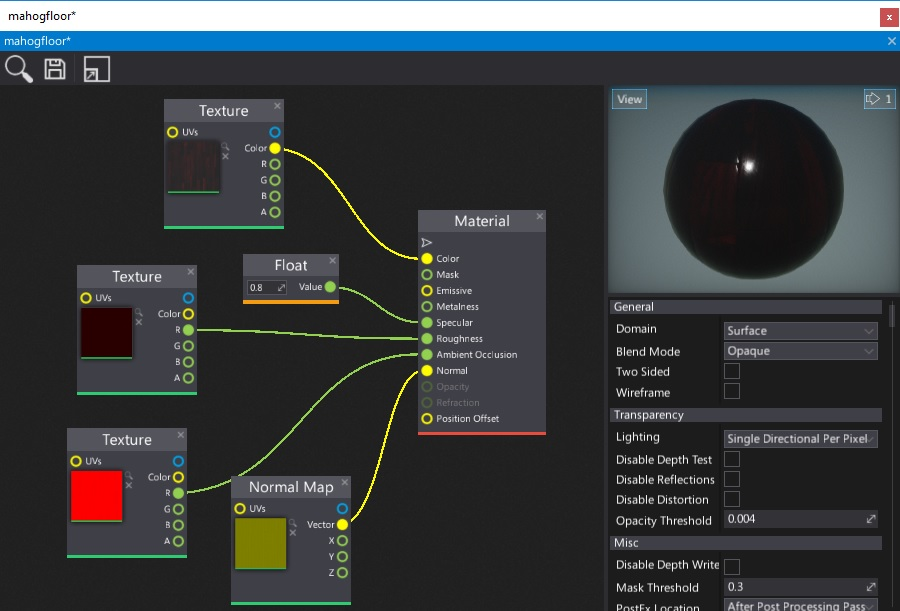
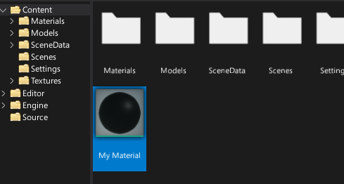
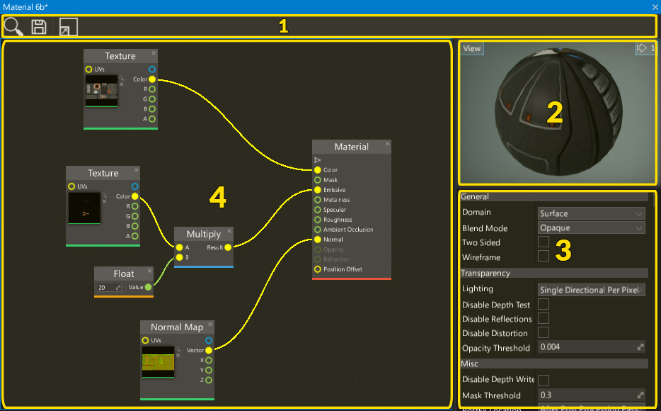
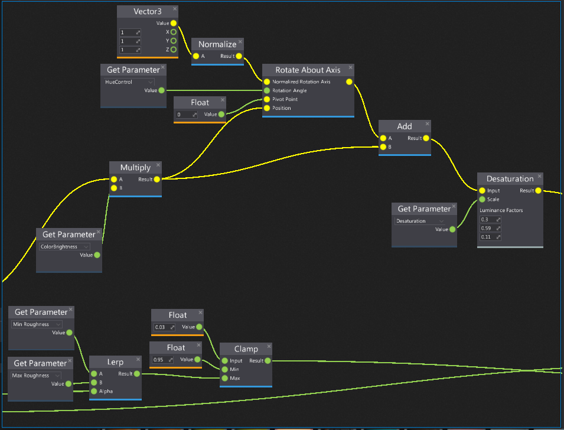
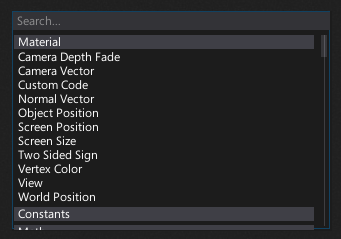
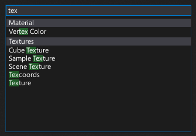

# Material Editor

**Material Editor Window** is a tool used to create and modify material assets. It enables developers to spawn and connect material nodes to create material graph.

This page describes some basic ideas behind the materials creation process and shows how to work with materials editor.

# Opening the material editor

To open material editor simply double click on a material asset (in *Content* window or in any asset picker control).

# Interface

The material editor window UI consists of a toolstrip, viewport, properties panel and surface graph.

1. Toolstrip
2. Viewport
3. Properties Panel
4. Surface Panel

## Toolstrip

The following table lists the options in the toolstrip and what they do.

| Icon | Description |
|--------|--------|
|  | Shows and selects the asset in the *Content* window |
|  | Saves the asset to the file |
|  | Shows the whole material graph on the surface |

## Viewport

The viewport panel shows the preview of the current material. During editing material (removing the node, connecting boxes, etc.) material is being updated live and all the changes can be seen in the viewport.

You can navigate in the viewport by using the **right mouse button** or zoom in/out by pressing right mouse button and using **mouse scroll wheel**.

Like all editor viewport that one also comes up with a *View* widget menu. By pressing that button you can debug material channels or view different debug mode or even change preview camera field of view angle. To lear more about using the editor viewports and related tools please read [debugging tools](../../debugging-tools/index.md) page.

## Properties panel

This panel contains all material asset properties and allows to edit them.

Additionaly there is a dropdown menu and *Add parameter* button in the bottom of the panel. It's used to add new material parameters. Simply select new parameter type from the menu and press button to spawn the new one.

To learn more about material properties see dedicated [Material Properties](../material-properties/index.md) page.

## Surface

The most important part of the material editor window is a **surface**. This panel contains a graph of all material nodes that belong to this material. By default, each material contains a single `Material` node. This node has a series of inputs, each associated with a different aspect of the material (as shown in a picture below).

To learn more about material inputs see dedicated [Material Inputs](../material-inputs.md) page.

# Navigation controls

Controls in the Material Editor generally match the controls of other tools in the Flax Editor. For example, the material node graph can be navigated as with other linked object editors, the material preview mesh can be oriented as per other mesh tools, etc.

## Mouse controls

| Control | Action |
|--------|--------|
| **RMB** drag on background  | Pan material nodes graph  |
| **RMB** on background | Show node creation menu |
| **RMB** on node | Show node edit menu |
| **LMB** drag on background | Select nodes with rectangle tool |
| **LMB** on node | Select node |
| **Ctrl + LMB** on node | Toggle selection of node |
| **LMB** on node header | Move selected nodes |
| **Mouse Wheel** | Zoom in/out |

## Keyboard controls

| Control | Action |
|--------|--------|
| **Ctrl + S** | Save the asset  |
| **Delete** | Delete selected nodes |

# Adding new node

In order to add a new material node right click on a surface background and select a node type from a popup or type its name to find it.

