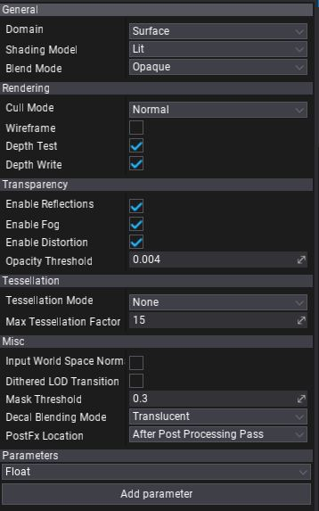
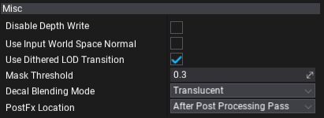

# Material Properties

This page breaks down all the available material properties. These options are accesible per material via [Material Editor](../material-editor/index.md) window.

## General

| Property | Description |
|--------|--------|
| **Domain** | Specifies how material is going to be used. Certain materials used for postFx or 2D rendering requrie additional instructions for the rendering pipeline to be generated. Because of this, it's important to specify material domain that covers those cases. Possible options: <table><tbody><tr><th>Option</th><th>Description</th></tr><tr><td>**Surface**</td><td>Used for object's surface materials (e.g. meshes). This is a default value.</td></tr><tr><td>**Post Process**</td><td>Used for the [Post Process Materials](../../post-effects/post-fx-materials.md)</td></tr><tr><td>**Decal**</td><td>Used for the [Decal Materials](../../decals/index.md)</td></tr><tr><td>**GUI**</td><td>Used for custom shader rendering in GUI.</td></tr></tbody></table>|
| **Blend Mode** | Specifies how blend material with the environment. Possible options: <table><tbody><tr><th>Option</th><th>Description</th></tr><tr><td>**Opaque**</td><td>The opaque material. Used during *GBuffer* pass rendering. This is a default value.</td></tr><tr><td>**Transparent**</td><td>The transparent material. Used during *Forward* pass rendering.</td></tr></tbody></table>|
| **Shading Model** | Specifies how material inputs and properties are combined to result the final surface color. Possible options: <table><tbody><tr><th>Option</th><th>Description</th></tr><tr><td>**Unlit**</td><td>The unlit material. Emissive channel is used as an output color. Can perform custom lighting operations or just glow. Won't be affected by the lighting pipeline.</td></tr><tr><td>**Lit**</td><td>The default lit material. The most common choice for the material surfaces.</td></tr><tr><td>**Subsurface**</td><td>The subsurface material. Intended for materials like vax or skin that need light scattering to transport simulation through the object.</td></tr></tbody></table>To learn more about shading models see the related documentation [here](../shading-models/index.md).|
| **Two Sided** | If checked, geometry using this material will be rendered with triangle faces culling disabled. This is commonly used option for foliage materials to keep from having double up the number of rendered polygons. However, two sided materials may not work correcly with static lighting, since mesh still uses only a single lightmap UVs channel. As a result, two sided materials with static lightmap wll be shaded the same on both sides.|
| **Wireframe** | If checked, geometry using this material will be rendered in wireframe mode without a solid triangles fill. |

## Transparency

| Property | Description |
|--------|--------|
| **Lighting** | Specifies lighting mode for transparent materials. Possible options: <table><tbody><tr><th>Option</th><th>Description</th></tr><tr><td>**None**</td><td>Shading is disabled.</td></tr><tr><td>**Single Directional Per Pixel**</td><td>Shading is performed per pixel for single directional light.</td></tr></tbody></table>|
| **Disable Depth Test** | If checked, disables depth test when rendering material. |
| **Disable Reflections** | If checked, disables reflections when rendering material. |
| **Disable Distortion** | If checked, disables distortion effect when rendering material. |
| **Opacity Threshold** | Controls opacity values clipping point. |

## Tessellation

| Property | Description |
|--------|--------|
| **Tessellation Mode** | Mesh surface tessellation method. Applies only to materials with *Domain* set to *Surface*. Possible options: <table><tbody><tr><th>Option</th><th>Description</th></tr><tr><td>**None**</td><td>No tessellation.</td></tr><tr><td>**Flat**</td><td>Flat tessellation. Also known as dicing tessellation.</td></tr><tr><td>**PointNormal**</td><td>Point normal tessellation.</td></tr><tr><td>**Phong**</td><td>Geometric version of Phong normal interpolation, not applied on normals but on the vertex positions.</td></tr></tbody></table>|
| **Max Tessellation Factor** | Maximum triangle tessellation factor. Default value is `15`. Increase it to unlock even higher tessellation. Higher values reduce rendering performance. |

## Miscellaneous

| Property | Description |
|--------|--------|
| **Disable Depth Write** | If checked, disables depth buffer write when rendering material.|
| **Mask Threshold** | Controls mask values clipping point. |
| **Decal Blending Mode** | Specifies decal material blending mode. Applies only to materials with *Domain* set to *Decal*. Possible options: <table><tbody><tr><th>Option</th><th>Description</th></tr><tr><td>**Translucent**</td><td>Decal will be fully blended with the material surface.</td></tr><tr><td>**Stain**</td><td>Decal color will be blended with the material surface color (using multiplication).</td></tr><tr><td>**Normal**</td><td>Decal will blend the normal vector only.</td></tr><tr><td>**Emissive**</td><td>Decal will apply the emissive light only.</td></tr></tbody></table>|
| **PostFx Location** | Specifies when render post effect material. Applies only to materials with *Domain* set to *Post Process*.Possible options: <table><tbody><tr><th>Option</th><th>Description</th></tr><tr><td>**After Post Processing Pass**</td><td>Render material after post processing pass using *LDR* input frame.</td></tr><tr><td>**Before Post Processing Pass**</td><td>Render material before post processing pass using *HDR* input frame.</td></tr><tr><td>**Before Forward Pass**</td><td>Render material before forward pass but after *GBuffer* with *HDR* input frame.</td></tr><tr><td>**After Custom Post Effects**</td><td>Render material after custom post effects (scripted).</td></tr><tr><td>**Before Reflections Pass **</td><td>Render material before Reflections pass. After the Light pass. Can be used to implement a custom light types that accumulate lighting to the light buffer.</td></tr><tr><td>**After Anti-Aliasing Pass **</td><td>Render material The after AA filter pass. Rendering is done to the output backbuffer.</td></tr></tbody></table>|

## Parameters

Every material contains a collection of custom parameters. Those parameters can be accessed from the game logic code or be overriden using [Material Instances](../instanced-materials/index.md).

This section allows to add, edit and remove custom material parameters. Each parameter has a specified type and default value. Material parameters are identified by the name which means it has to be unique in order to prevent misleading.

To add new parameter choose a type from a dropdown menu and press **Add parameter** button. Then you can **right click on prameetr name** to rename or delete it.

To access material parameter value directly in a graph use **Get Parameter**. It allows to choose parameter with a dropdown menu and use it's value as shown in a picture below.

