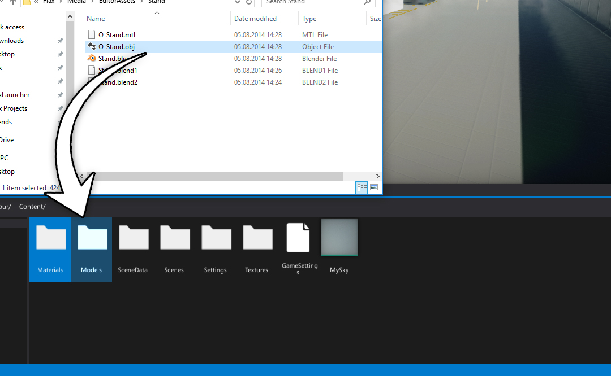
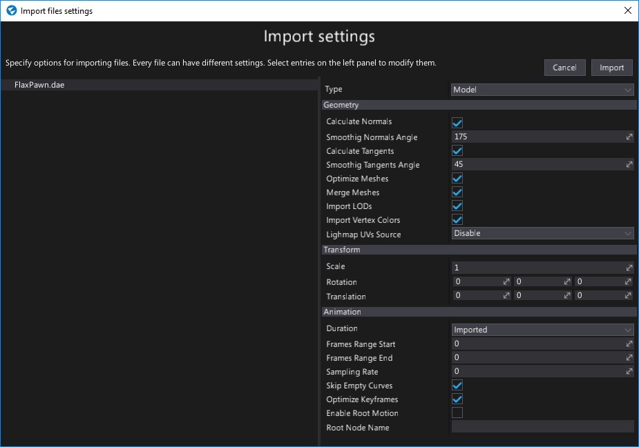

# Importing models

Importing model files works in the same way as for other asset types. Simply drag and drop the model files from *Explorer* into the *Content* window or use the *Import* button.

After choosing the files **Import file settings** dialog shows up. It's used to specify import options per model. In most cases the default values are fine and you can just press the **Import** button.

> [!Note]
> Using **Import file settings** dialog you can select more than one model at once (or use **Ctrl+A** to select all) and specify import options at once.

Every model can be reimport (relative path to the source file is cached) and import settings modified using [Model Window](model-window.md).

## Supported file types

Flax Engine supports importing the following list of file types as models:
- `.fbx`
- `.obj`
- `.x`
- `.dae`
- `.blend`
- `.lwo`
- `.lws`
- `.lxo`
- `.ply`
- `.q3o`
- `.q3s`
- `.stl`

## Importing model LODs

Flax supports up to 6 model level of details. To import them use `LODx` (where `x` is a LOD index, zero-based) postfix for object nodes in model file. Also when importing model ensure to check the **Import LODs** option.

Example usage (from Blender):

## Model import settigns

| Property | Description |
|--------|--------|
| **Scale** | Custom uniform scale applied to the imported model data. |
| **Calculate Normals** | If checked, model normal vectors will be recalculated. |
| **Smoothing Normals Angle** | Generated normal vector smoothing angle (in degrees). Used only if *Calculate Normals* is checked. |
| **Calculate Tangents** | If checked, model tangent vectors will be recalculated. |
| **Optimize Meshes** | If checked, model meshes geometry will be optimized. Duplicated or invalid vertices will be removed. Index buffer will be reordered to improve performance and other modification will be applied. However, importing time will be increased. |
| **Merge Meshes** | If checked, meshes with the same materials will be merged. Helps with rendering performance. |
| **Import LODs** | If checked, model importer will try to find LODs and import them. See *Importing model LODs* section to learn more. |
| **Import Vertex Colors** | If checked, vertex colors will be imported (channel 0 only, if exists). |
| **Lightmap UVs Source** | Specifies model lightmap texture coordinates source. Can import them from the source model or generate them with in-build tool. Possible options: <table><tbody><tr><th>Option</th><th>Description</th></tr><tr><td>**Disable**</td><td>Don't use lightmap UVs.</td></tr><tr><td>**Generate**</td><td>Generate lightmap UVs from model geometry. Requires proper normal/tangent vectors. Highly increases the importing time.</td></tr><tr><td>**Channel 0**</td><td>Use input mesh texture coordinates channel 0.</td></tr><tr><td>**Channel 1**</td><td>Use input mesh texture coordinates channel 1.</td></tr><tr><td>**Channel 2**</td><td>Use input mesh texture coordinates channel 2.</td></tr><tr><td>**Channel 3**</td><td>Use input mesh texture coordinates channel 3.</td></tr>|
