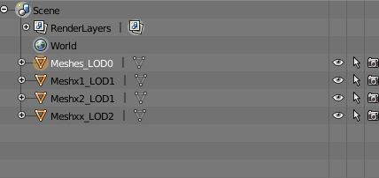

# Importing models

Importing model files works in the same way as for other asset types. Simply drag and drop the model files from *Explorer* into the *Content* window or use the *Import* button.

After choosing the files **Import file settings** dialog shows up. It's used to specify import options per model. In most cases the default values are fine and you can just press the **Import** button.

> [!Note]
> Using **Import file settings** dialog you can select more than one model at once (or use **Ctrl+A** to select all) and specify import options at once.

Every model can be reimport (relative path to the source file is cached) and import settings modified using [Model Window](model-window.md).

## Supported file types

Flax Engine supports importing the following list of file types as models:
- `.fbx`
- `.gltf`
- `.glb`
- `.obj`
- `.x`
- `.dae`
- `.blend`
- `.lwo`
- `.lws`
- `.lxo`
- `.ply`
- `.q3o`
- `.q3s`
- `.stl`

## Importing model LODs

Flax supports up to 6 model level of details. To import them use `LODx` (where `x` is a LOD index, zero-based) postfix for object nodes in model file. Also when importing model ensure to check the **Import LODs** option.

Example usage (from Blender):

## Model import settigns

Flax uses the same import settings data scheme for **models**, **skinned models** and **animations** as they are can be imported from the same source files (eg. `.fbx` or `.dae`).

| Property | Description |
|--------|--------|
| **Type** | The type of the imported asset. Possible options: <table><tbody><tr><th>Option</th><th>Description</th></tr><tr><td>**Model**</td><td>The model asset.</td></tr><tr><td>**SkinnedModel**</td><td>The skinned model asset.</td></tr><tr><td>**Animation**</td><td>The animation asset.</td></tr></table></tbody> |
|||
| **Geometry** ||
| **Calculate Normals** | If checked, model normal vectors will be recalculated. |
| **Smoothing Normals Angle** | Specifies the maximum angle (in degrees) that may be between two face normals at the same vertex position that their are smoothed together. Used only if *Calculate Normals* is checked. The default value is 175. |
| **Calculate Tangents** | If checked, model tangent vectors will be recalculated. |
| **Smoothing Tangents Angle** | Specifies the maximum angle (in degrees) that may be between two vertex tangents that their tangents and bi-tangents are smoothed. Used only if *Calculate Tangents* is checked. The default value is 45. |
| **Optimize Meshes** | If checked, model meshes geometry will be optimized. Duplicated or invalid vertices will be removed. Index buffer will be reordered to improve performance and other modification will be applied. However, importing time will be increased. |
| **Merge Meshes** | If checked, meshes with the same materials will be merged. Helps with rendering performance. |
| **Import LODs** | If checked, model importer will try to find LODs and import them. See *Importing model LODs* section to learn more. |
| **Import Vertex Colors** | If checked, vertex colors will be imported (channel 0 only, if exists). |
| **Lightmap UVs Source** | Specifies model lightmap texture coordinates source. Can import them from the source model or generate them with in-build tool. Possible options: <table><tbody><tr><th>Option</th><th>Description</th></tr><tr><td>**Disable**</td><td>Don't use lightmap UVs.</td></tr><tr><td>**Generate**</td><td>Generate lightmap UVs from model geometry. Requires proper normal/tangent vectors. Highly increases the importing time.</td></tr><tr><td>**Channel 0**</td><td>Use input mesh texture coordinates channel 0.</td></tr><tr><td>**Channel 1**</td><td>Use input mesh texture coordinates channel 1.</td></tr><tr><td>**Channel 2**</td><td>Use input mesh texture coordinates channel 2.</td></tr><tr><td>**Channel 3**</td><td>Use input mesh texture coordinates channel 3.</td></tr></table></tbody>|
|||
| **Transform** ||
| **Scale** | Custom uniform scale applied to the imported model data. |
| **Rotation** | Custom import geometry rotation applied to the imported model data. |
| **Translation** | Custom import geometry offset applied to the imported model data. |
|||
| **Animation** ||
| **Duration** | Specifies the imported animation duration mode. Can use the original value or overriden by settings. Possible options: <table><tbody><tr><th>Option</th><th>Description</th></tr><tr><td>**Imported**</td><td>The imported duration.</td></tr><tr><td>**Custom**</td><td>The custom duration specified via keyframes range.</td></tr></table></tbody>|
| **Frames Range Start** | Imported animation first frame index. Used only if Duration mode is set to Custom. |
| **Frames Range End** | Imported animation last frame index. Used only if Duration mode is set to Custom. |
| **Default Frame Rate** | The imported animation default frame rate. Can specify the default frames per second amount for imported animation. If value is 0 then the original animation frame rate will be used. |
| **Sampling Rate** | The imported animation sampling rate. If value is 0 then the original animation speed will be used. |
| **Skip Empty Curves** | If checked, the imported animation will have removed tracks with no keyframes or unspeficied data. Disable it to leave the data as it is. |
| **Optimize Keyframes** | If checked, the imported animation channels will be optimized to remove redundant keyframes. This option helps with getting better animation sampling performance. |
| **Enable Root Motion** | If checked, enables root motion extraction support from this animation. |
| **Root Node Name** | The custom node name to be used as a root motion source. If not specified the actual root node will be used. |
| **Restore Materials On Reimport** | If checked, the importer will try to restore the model material slots. |
