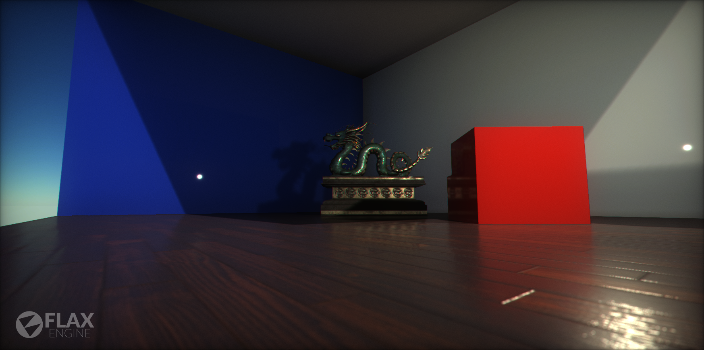
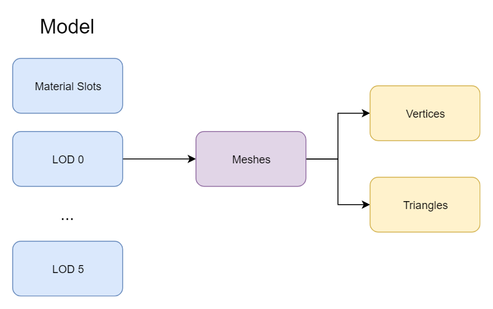
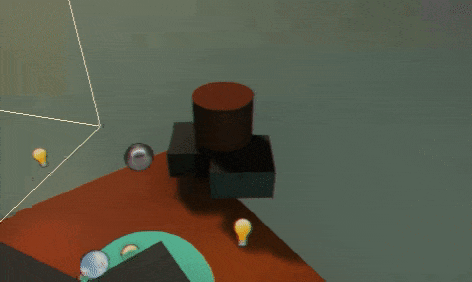

# Models

**Models** are one of the most important parts of the games. Player character and whole environment can be created using them. Flax supports importing model files created by using the most common 3D modeling software (e.g. Maya, 3dsMax, Blender) or generating procedural geometry.

A Model asset contains a collection of **Level Of Details** (shorten as *LOD*) and **Material Slots**. Each LOD contains a collection meshes to draw. During model rendering, each mesh uses a specific material slot which can hold the default value or be overridden by the [Static Model](static-model.md).

> [!Note]
> The maximum amount of levels of details for the model is `6`. Also, each LOD can contain up to `4096` meshes.

A **mesh** consists of triangles arranged in 3D space to create the impression of a solid object. A triangle is defined by its three corner points (called vertices). In the [Mesh](http://docs.flaxengine.com/api/FlaxEngine.Mesh.html) class, the vertices are all stored in a single array and each triangle is specified using three integers that correspond to indices of the vertex array. The triangles are also collected together into a single array of integers; the integers are taken in groups of three from the start of this array, so elements 0, 1 and 2 define the first triangle, 3, 4 and 5 define the second, and so on. Any given vertex can be reused in as many triangles as desired.

## Model LOD switching

Flax supports dynamic model LODs switching based on a model instance screen size (in percentage). Here is an example of this feature:

By enabling **Use Dithered LOD Transition** option on model materials you can use smooth LOD transitions that reduce popping artifacts and produce a seamless way to reduce geometry complexity in the scene.

In some cases, eg. during the cut-scenes it may be required to bump the visual quality of the scene and ignore the lower LODs. To achieve this you can apply the Model LOD Bias per view using the following C# code:

``
MainRenderTask.Instance.View.ModelLODBias = 2;
``

or adjusting it per model instance using **LOD Bias** and **Forced LOD** properties.

## Importing models

To learn about importing model assets and adjusting import settings read the dedicated [page here](import.md).

Flax supports **generating LODs automatically** during source asset importing. When importing model file simply check **Generate LODs** property (under *Level Of Detail* group) and adjust the settings.

## Using models

Model assets are used by the many parts of the engine. The most common case is by creating a **Static Model**. That actor type renders a model and allows to override some of its properties like shadows casting or material slots collection. To learn more about it see a dedicated [page here](static-model.md).

## Procedural geometry

Flax provides a C# scripting API to generate procedural mesh geometry offline or at runtime.
Model created from code can have all the properties as the imported one. Although there are some limitations like no baking lightmaps or reduced amount of LODs. However procedural models can be saved to the asset file in the editor and then used in a game. This feature can be highly used by the Editor Plugins.

To learn more about creating procedural meshes see the [tutorial here](generate-model.md).

## Geometry instancing

Flax supports hardware geometry instancing out of the box. During scene rendering all model instances that use the same model and materials are batched and rendered at once to provide ultra-high performance. Flax can merge thousands of mesh instances into just a single draw call as long as they are using the same material. Instancing and draw calls batching is enabled by default on platforms that support it.

## Vertex Painting

Another important topic related to models is **Vertex Painting**. It is a process of applying custom colors to the model geometry represented by the vertices of the mesh. This technique can be used to customize model instance in the level. For instance, wall material can use red channel of the vertex color to display the wet areas. Then level designer can paint wall vertices to make a certaing part of the model appear wet. To learn more about this process see the related documentation [here](vertex-painting.md).

## Vertex properties

Flax uses fixed model data format. Although index buffer can use 16 or 32-bit format layout vertex buffers layout is strictly defined. Vertex Buffers data is highly compressed to reduce memory usage and optimize the rendering performance.

Here are listed vertex structures used by the engine:

**Vertex Buffer 0**:
* Vector3 Position

**Vertex Buffer 1**:
* Half2 TexCoord
* Float1010102 Normal
* Float1010102 Tangent
* Half2 LightmapUVs

**Vertex Buffer 2** (*optional*):
* Color32 Color

