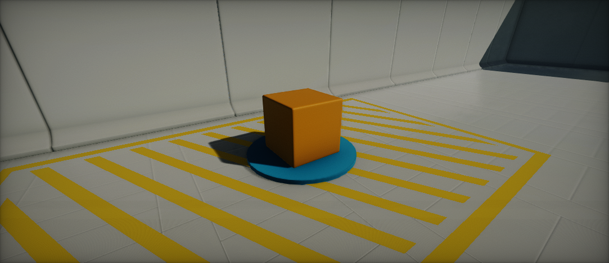
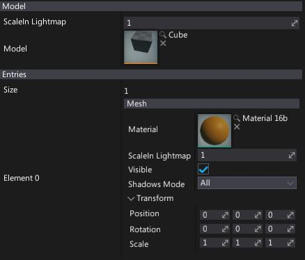

# Model Actor

**Model Actor** renders a model and allows to override some of its properties like shadows casting or material slots collection. Using model actors it the most common way to place models in you scene.

## Model Properties

| Property | Description |
|--------|--------|
| **Scale In Lightmap** | Model meshes scale in lightmap. Master parameter to scale all of the meshes. |
| **Bounds Scale** | Model bounds scale parameter. It is useful when using Position Offset to animate the vertices of the object outside of its bounds. Increasing the bounds of an object will reduce performance and shadow quality. |
| **Hidden Shadow** | If checked, the object will cast a shadow but won't be visible. |
| **Model** | Model asset to use for rendering. |
| **Entries** | Colelction of model slots to override. See *Mesh Properties* section to learn more. |

## Mesh Properties

| Property | Description |
|--------|--------|
| **Material** | Material or Material Instance asset to use for rendering. |
| **Scale In Lightmap** | Mesh scale in lightmap. |
| **Visible** | If checked, mesh is visible. Allows to hide meshes using this entry. |
| **Transform** | Local transformation (translation, rotation and scale) applied to the meshes using this slot. Can be used to a rotate plane wing or move a group of meshes. |
| **Receive Decals** | Determines whenever this mesh can receive decals. |
| **Shadows Mode** | Shadows casting mode by meshes using this entry. Possible options:  <table><tbody><tr><th>Option</th><th>Description</th></tr><tr><td>**None**</td><td>Never render shadows.</td></tr><tr><td>**Static Only**</td><td>Render shadows only in static views (env probes, lightmaps, etc.).</td></tr><tr><td>**Dynamic Only**</td><td>Render shadows only in dynamic views (game, editor, etc.).</td></tr><tr><td>**All**</td><td>Always render shadows.</td></tr></tbody></table> |
