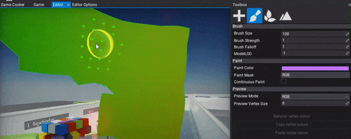

# Vertex Painting

**Vertex Painting** is a process of applying custom colors to the model geometry represented by the vertice sof the meshe. This techqnice can be used to customize model instance in the level. For instance, wall material can use red channel of the vertex color to display the wet areas. Then level designer can paint wall vertices to make a certaing part of the model appear wet.

Flax supports storing 4-channel RGBA (32-bit) color *per-vertex*. This color can be imported from the original model asset or created in Editor.

## How to paint model in Editor?

[Toolbox](../../editor/windows/toolbox.md) window contains a tab with Vertex Painting utilities. Select it and then pick a model on a scene to paint. Window contains many options to adjust brush and paint options.

After selecting the model and tab the editor will display its vertex colors. You can preview a single color channel or disable the debug view by using **Preview Mode** option.
Now, you can use the left-mouse button to paint the vertices with a spherical brush in the editor viewport.

## How to access vertex color in material?

To read the painter vertices colors you can use **Vertex Color** node in materials. That can be useful to adjust the object appearance.

