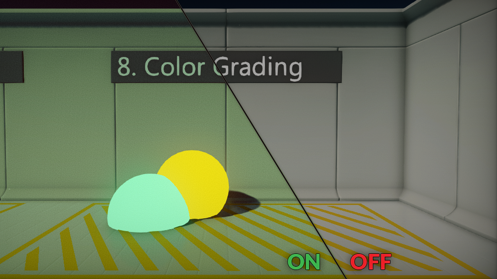
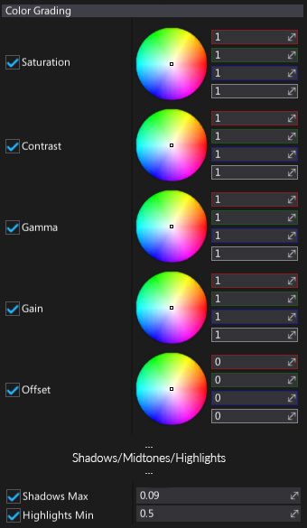
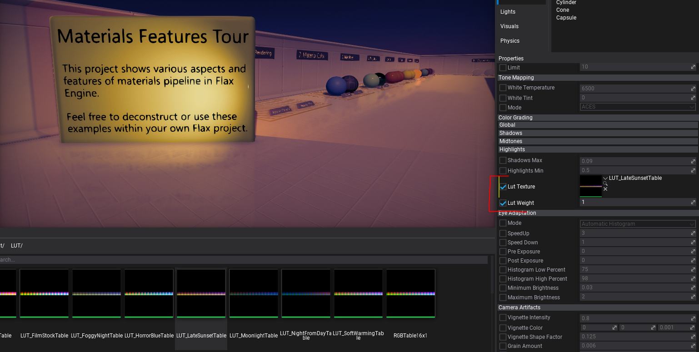

# Color Grading

**Color Grading**, or **color correction** , is an effect is used to enhance the overall scene colors. Flax Engine provides solid color grading tools that enable artists to color correct cut-scenes and gameplay look right inside the editor with live preview. This means a huge step forward in good looking games production.

To use custom color grading LUTs see a section below to learn how to import and apply Lookup Table texture.

## Color Wheels

In the *color grading* options section you'll find **color wheels** (also called **trackballs**). They are used to perform *three-way* color grading with more "artistic" control.

Adjusting the position of the point on the color wheel will have the effect of shifting the hue of the image towards that color in the given tonal range. Different color wheels are used to affect different ranges within the image. Adjusting the sliders on the right of the wheel allows you to specify desire color manually or modify only single channel (`Red`, `Green` or `Blue`). Additional `Alpha` slider is used to offsets the color lightness. You can think about it as a 'scale' value.

## Properties

Color grading trackballs are divided into 4 groups:

- Master
- Shadows
- Midtones
- Highlights

Each group controls a selected part of the range (except *Master* which affects the whole image).

| Property | Description |
|--------|--------|
| **Saturation** | Adjusts the intensity (purity) of the colors (hue) that are being represented. A higher saturation intensity will result in colors appearing more like their purest forms (red, green, blue) and when saturation is lowered colors will appear more gray or washed-out. |
| **Contrast** | Adjusts the tonal range of dark and light color values in the scene. Lowering the intensity will remove highlights and lighten the image resulting in a washed-out appearance, whereas a higher intensity will tighten the highlights and darken the overall image. |
| **Gamma** | Adjusts the luminance intensity of the image's mid-tones to accurately reproduce colors. Lowering or raising this value will result in the image being washed-out or too dark. |
| **Gain** | Adjusts the luminance intensity of the image's whites (highlights) to accurately reproduce colors. Raising or lowering this value will result in the image highlights being washed-out or too dark. |
| **Offset** | Adjusts the luminance intensity of the image's blacks (shadows) to accurately reproduce colors. Raising or lowering this value will result in the image shadows being washed-out or too dark. |
|||
| **Shadows** | Saturation/Contrast/Gamma/Gain work in the same way as the master values but apply only to the scene shadows. |
|||
| **Midtones** | Saturation/Contrast/Gamma/Gain work in the same way as the master values but apply only to the scene mid-tones. |
|||
| **Highlights** | Saturation/Contrast/Gamma/Gain work in the same way as the master values but apply only to the scene highlights. |
|||
| **Shadows Max** | Controls the luminance intensity of the image's blacks (shadows) to accurately reproduce colors. Raising or lowering this value will result in the image shadows being washed-out or too dark. |
| **Highlights Min** | Controls a multiplier of the properties that affect the color correction properties that have been adjusted in the Highlights section. |

## Custom LUT Textures

**Lookup Table (LUT)** is used to perform color correction for the final rendered image. The blending is performed in LDR and is applied after tonemapping, procedural color correction and exposure control.

**LUT** textures used in Flax must be unwrapped **256x16** textures imported without compression, without mipmaps and with RGB channels usd only.

Example LUT texture:

To apply the LUT simply add PostFx Volume actor and asssing the texture and weight in the *Color Grading* category.

To make own LUT texture you can take a screenshot of the game viewport, then perform a custom color correction to achieve the desire look. Then apply the same colro grading to the neutral LUT and use it for colro grading in engine.
Here you can download the neutral LUT:

