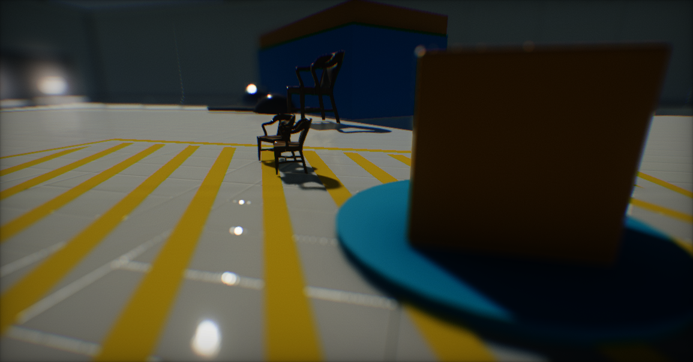
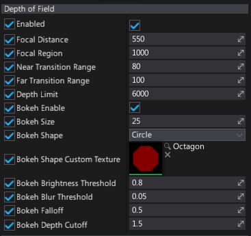

# Depth of Field

**Depth of Field** effect simulates the behavior of a real-life camera lens focusing on an object. This is effect buries image areas that are out of focus and generates Bokeh shapes. It really helps with creating realistic looking scenes and is one of the most important parts of the game cut-scenes.

## Properties

| Property | Description |
|--------|--------|
| **Enabled** | If checked, depth of field effect will be visible. |
| **Blur Strength** | The blur intensity in the out-of-focus areas. Allows reducing blur amount by scaling down the Gaussian Blur radius. Normalized to range 0-1. |
| **Focal Distance** | Distance from the camera (in world units) of the center point of the focus area. |
| **Focal Region** | Controls length of the focal region (in world units). |
| **Near Transition Range** | Near camera blur transition distance (in world units). |
| **Far Transition Range** | Far camera blur transition distance (in world units). |
| **Depth Limit** | The maximum pixel depth to be affected by the depth of field (in world units). Useful for rejecting effect on sky and skyboxes. |
| **Bokeh Enable** | If checked, bokeh shapes will be rendered. |
| **Bokeh Size** | Controls size of the bokeh shapes. |
| **Bokeh Shape** | Defines bokeh shapes type. Possible options: <table><tbody><tr><th>Option</th><th>Description</th></tr><tr><td>**Hexagon**</td><td>The hexagon shape. </td></tr><tr><td>**Octagon**</td><td>The octagon shape. </td></tr><tr><td>**Circle**</td><td>The circle shape. </td></tr><tr><td>**Cross**</td><td>The cross shape. </td></tr><tr><td>**Custom**</td><td>The custom texture shape (uses *Bokeh Shape Custom Texture* property).</td></tr></tbody></table>|
| **Bokeh Shape Custom Texture** | If *Bokeh Shape* is set to **Custom**, then this texture will be used for the bokeh shapes. For best performance, use small, compressed, grayscale textures (for instance 32px) |
| **Bokeh Brightness Threshold** | The minimum pixel brightness to create bokeh. Pixels with lower brightness will be skipped. |
| **Bokeh Falloff** | Controls bokeh shapes brightness falloff. Higher values reduce bokeh visibility. |
| **Bokeh Depth Cutoff** | Controls bokeh shape generation for depth discontinuities. |
