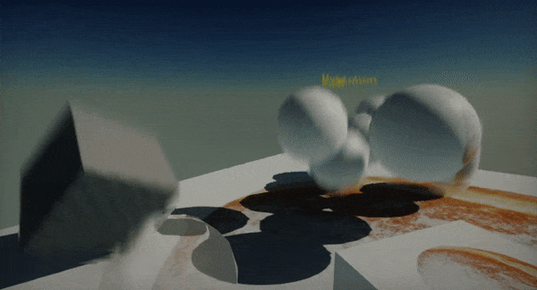
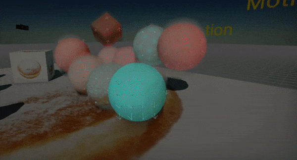

# Motion Blur

**Motion Blur** effect simulates the blur of the objects based on its motion. When objects filmed by a camera are moving faster than the camera’s exposure time they are appearing as blurred on the edges. This can be caused by rapidly moving objects or a long exposure time. The effect itself is based on *Motion Vectors* buffer rendering which contains a objects pixels moving across the screen.

## Properties

| Property | Description |
|--------|--------|
| **Enabled** | If checked, motion blur effect will be rendered. |
| **Scale** | Motion Blur effect strength. Value 0 disabled is, while higher values increase the effect. |
| **Sample Count** | The amount of sample points used during motion blur rendering. It affects quality and performances. |
| **Motion Vectors Resolution** | The motion vectors texture resolution. Motion blur uses per-pixel motion vectors buffer that contains objects movement information. Use lowe resolution to improve performance. |

## Motion Vectors Debug

The editor supports rendering motion vectors visualization by checking the **View -> Debug View -> Motion Vectors**.
You can use it to preview and debug motion vectors of your game objects.
