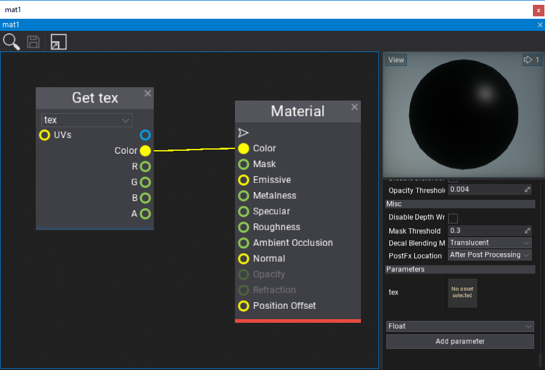
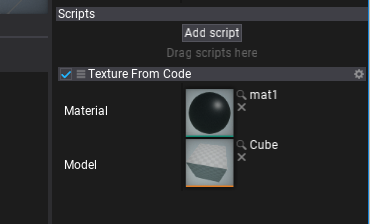

# HOWTO: Generate procedural texture


In this tutorial, you will learn how to create a simple texture from C# script code.

This sample uses C# API method [Content.CreateVirtualAsset<T>](http://docs.flaxengine.com/api/FlaxEngine.Content.html#FlaxEngine_Content_CreateVirtualAsset__1) to generate procedural texture resource which can be modified at runtime from code.

## Tutorial

### 1. Create new C# script `TextureFromCode`

### 2. Write texture data generating code

```cs
public class TextureFromCode : Script
{
	private Texture _tempTexture;
	private MaterialInstance _tempMaterialInstance;

	public Material Material;
	public Model Model;

	public unsafe override void OnStart()
	{
		// Ensure that model asset is loaded
		Model.WaitForLoaded();

		// Create new texture asset
		var texture = Content.CreateVirtualAsset<Texture>();
		_tempTexture = texture;
		TextureBase.InitData initData;
		initData.Width = 64;
		initData.Height = 64;
		initData.ArraySize = 1;
		initData.Format = PixelFormat.R8G8B8A8_UNorm;
		var data = new byte[initData.Width * initData.Height * initData.Format.SizeInBytes()];
		fixed (byte* dataPtr = data)
		{
			// Generate pixels data (linear gradient)
			var colorsPtr = (Color32*)dataPtr;
			for (int y = 0; y < initData.Height; y++)
			{
				float t1 = (float)y / initData.Height;
				var c1 = Color32.LerpUnclamped(Color.Red, Color.Blue, t1);
				var c2 = Color32.LerpUnclamped(Color.Yellow, Color.Green, t1);
				for (int x = 0; x < initData.Width; x++)
				{
					float t2 = (float)x / initData.Width;
					colorsPtr[y * initData.Width + x] = Color32.LerpUnclamped(c1, c2, t2);
				}
			}
		}
		initData.Mips = new[]
		{
			// Initialize mip maps data container description
			new TextureBase.InitData.MipData
			{
				Data = data,
				RowPitch = data.Length / initData.Height,
				SlicePitch = data.Length
			},
		};
		texture.Init(initData);

		// Use a dynamic material instance with a texture to sample
		var material = Material.CreateVirtualInstance();
		_tempMaterialInstance = material;
		material.GetParam("tex").Value = texture;

		// Add a model actor and use the dynamic material for rendering
		var staticModel = Actor.GetOrAddChild<StaticModel>();
		staticModel.Model = Model;
		staticModel.Entries[0].Material = material;
	}

	public override void OnDestroy()
	{
		// Ensure to cleanup resources
		FlaxEngine.Object.Destroy(ref _tempTexture);
		FlaxEngine.Object.Destroy(ref _tempMaterialInstance);
	}
}
```

### 3. Create material

Create a sample material that contains a public texture parameter named `tex`. It's used by the script to assign a texture to draw.



### 4. Link material and model

Add created script `TextureFromCode` to an actor in your scene (or create a new one for it). Then select it and assign the model and created material (as shown in a picture below).



### 5. Test it out!

Press **Play** (or *F5*) and see the results!


