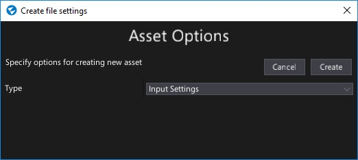
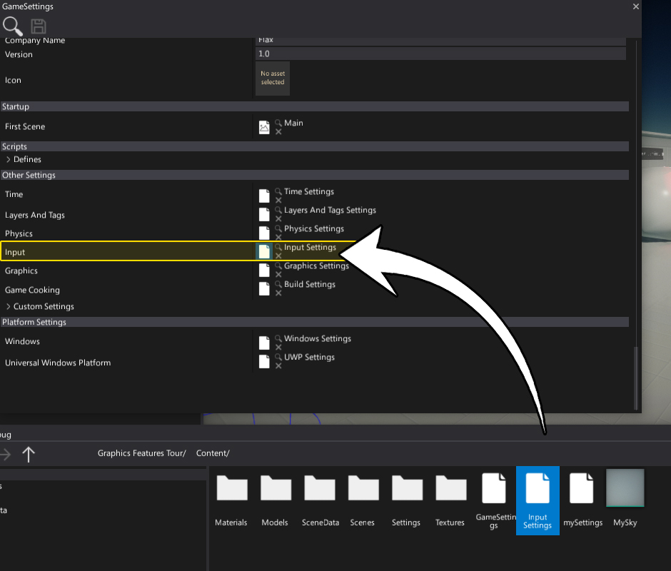
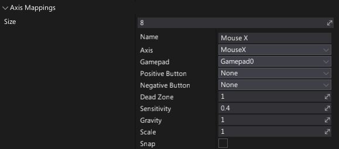

# Input Settings

**Input Settings asset** is used to specify the initial game input configuration. This asset contains description of the virtual actions and axes that are used to map physical input data into the more unified usage. See [Virtual Input](virtual-input.md) to learn more about it.

## Create input settings

1. Navigate to the Content directory in the *Content* window

2. Right-click and select option **New -> Settings**, specify the asset name (eg. *Input Settings*) and hit *Enter*
    

3. Choose option **Input Settings** and press **Create** button
    

4. Double-click on an asset to open it and edit
    

## Use input settings

You can create as many input settings as you want (even special versions per platform) but only one can be used during game building. Use **Game Settings** asset (always located in `Content/GameSettings.json`) to link the input options. If your game is using more advanced confgiuration you can edit the game settings from code in your build script (use [GameSettings.Load](https://docs.flaxengine.com/api/FlaxEditor.Content.Settings.GameSettings.html#FlaxEditor_Content_Settings_GameSettings_Load) and [GameSettings.Save](https://docs.flaxengine.com/api/FlaxEditor.Content.Settings.GameSettings.html#FlaxEditor_Content_Settings_GameSettings_Save__1___0_) from C# API).

## Action Mappings

**Action Mappings** are used to configure a virtual actions. It's usefull to bind a physical mouse or gamepad buttons to specific actions identified by the name. Later game may track those input events using action names.

Usefull C# API: [InputEvent](https://docs.flaxengine.com/api/FlaxEngine.InputEvent.html), [Input.ActionConfig](https://docs.flaxengine.com/api/FlaxEngine.Input.ActionConfig.html) and [Input.ActionMappings](https://docs.flaxengine.com/api/FlaxEngine.Input.html#FlaxEngine_Input_ActionMappings).

| Property | Desciption |
|--------|--------|
| **Name** | The action *"friendly name"* used to access it from code. |
| **Mode** | The trigger mode. Allows to specify when input event should be fired. See [InputActionMode](https://docs.flaxengine.com/api/FlaxEngine.InputActionMode.html). |
| **Key** | The [keyboard key](https://docs.flaxengine.com/api/FlaxEngine.Keys.html) to map for this action. Use *None* to ignore it. |
| **Mouse Button** | The [mouse button](https://docs.flaxengine.com/api/FlaxEngine.MouseButton.html) to map for this action. Use *None* to ignore it. |
| **Gamepad Button** | The [gamepad button](https://docs.flaxengine.com/api/FlaxEngine.GamePadButton.html) to map for this action. Use *None* to ignore it. |
| **Gamepad** | Which gamepad should be used. |

## Axis Mappings

**Axis Mappings** are used to configure a virtual axes. It's usefull to bind a physical gamepad trigger or a mouse movement into a normalized and unified input source. Later game may access those input axes values using a virtual input interface.

Usefull C# API: [InputAxis](https://docs.flaxengine.com/api/FlaxEngine.InputAxis.html), [Input.AxisConfig](https://docs.flaxengine.com/api/FlaxEngine.Input.AxisConfig.html) and [Input.AxisMappings](https://docs.flaxengine.com/api/FlaxEngine.Input.html#FlaxEngine_Input_AxisMappingsAxisConfig).

| Property | Desciption |
|--------|--------|
| **Name** | The axis *"friendly name"* used to access it from code. |
| **Axis** | The axis type (mouse, gamepad, etc.). See [InputAxisType](https://docs.flaxengine.com/api/FlaxEngine.InputAxisType.html). |
| **Gamepad** | Which gamepad should be used. |
| **Positive Button** | The button to be pressed for movement in positive direction. Use *None* to ignore it. |
| **Negative Button** | The button to be pressed for movement in negative direction. Use *None* to ignore it. |
| **Dead Zone** | Any positive or negative values that are less than this number will register as zero. Useful for gamepads to specify the deadzone. |
| **Sensitivity** | For keyboard input, a larger value will result in faster response time (in units/s). A lower value will be more smooth. For Mouse delta the value will scale the actual mouse delta. |
| **Gravity** | For keyboard input describes how fast will the input recenter. Speed (in units/s) that output value will rest to neutral value if not when device at rest. |
| **Scale** | Additional scale parameter applied to the axis value. Allows to invert it or modify the range. |
| **Snap** | If checked, the axis value will be immediately reset to zero after it receives opposite inputs. Used for keyboard input only. |

