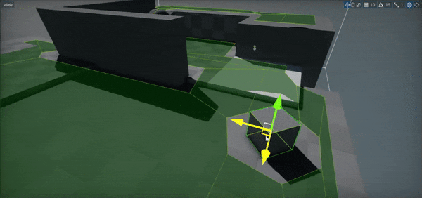

# Navigation

Flax supports navigation and pathfinding utilities that can be used across various types of games. You can use navigation system to control how AI characters and other objects navigate around game evironment without colliding with the walls and avoiding obstacles.

## Nav Mesh

Navigation meshes (shorten as navmeshes) are polygon surfaces that define the 'walkable' area of the scene. They are used to query paths for objects to navigate around the game level.
Flax supports both runtime generated navmesh and prebuild in Editor. The navmesh building process is asynchronious and does not block game logic thread. Progress reporting is also supported.

Under the hood, navigation mesh is split into tiles that are stored per scene. When you game loads a given scene, engine will stream the navigation mesh tiles into one big Nav Mesh object that is used to perform navigation queries including pathfinding. This allows to split huge worlds into smaller scenes and stream them at runtime while navigation agents will still work ina proper way.

## In this section

* [Nav Mesh Bounds Volume](nav-mesh-bounds-volume.md)
* [Nav Link](nav-link.md)
* [Navigation Settings](navigation-settings.md)

## Tutorials

* [How to create navmesh](tutorials/create-navmesh.md)
* [How to create path following agent](tutorials/path-following.md)
