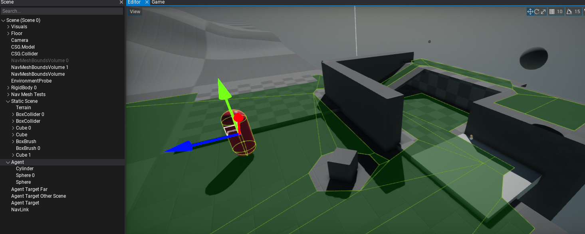

# HOWTO: Create path following agent

In this tutorial, you will learn how to implement a simple script that uses pathfinding to move the object thought the scene to the destination location.

## 1. Setup a scene

Firstly you will need to preapre you level, setup the navmesh and the object to move (our agent).



## 2. Create agent logic script

Create and implement the following script:

```cs
public class Agent007 : Script
{
    [Tooltip("The target object to follow.")]
    public Actor MoveToTarget;

    [Tooltip("The offset applied to the actor position on moving it.")]
    public Vector3 Offset = new Vector3(0, 100, 0);

    public float Speed = 10.0f;

    private Vector3 _targetPos;
    private Vector3[] _path;
    private float _pathLength;
    private float _pathPosition;

    void Update()
    {
        if (!MoveToTarget)
        {
            Debug.LogError("No target to move.");
            return;
        }

        var currentPos = Actor.Position;
        var targetPos = MoveToTarget.Position;

        // Check if reached target location
        if (Vector3.DistanceSquared(currentPos, targetPos) < 2)
            return;

        // Check if need to build a new path
        if (targetPos != _targetPos)
        {
            _targetPos = targetPos;
            _pathPosition = 0;
            _pathLength = 0;
            if (!Navigation.FindPath(currentPos, targetPos, out _path))
            {
                Debug.LogError("Failed to find path to the target.");
                return;
            }

            // Move the start/end points to navmesh floor
            if (_path.Length != 0)
                Navigation.ProjectPoint(_path[0], out _path[0]);
            if (_path.Length > 1)
                Navigation.ProjectPoint(_path[_path.Length - 1], out _path[_path.Length - 1]);

            // Compute path length
            for (int i = 0; i < _path.Length - 1; i++)
            {
                var segmentLength = Vector3.Distance(_path[i], _path[i + 1]);
                _pathLength += segmentLength;
            }
        }

        // Skip if has no path
        if (_path == null)
            return;

        // Move
        var pathProgress = Mathf.Min(_pathLength * _pathPosition + Time.DeltaTime * Speed, _pathLength);
        _pathPosition = pathProgress / _pathLength;

        // Calculate position on path
        float segmentsSum = 0;
        for (int i = 0; i < _path.Length - 1; i++)
        {
            var segmentLength = Vector3.Distance(_path[i], _path[i + 1]);
            if (segmentsSum <= pathProgress && segmentsSum + segmentLength >= pathProgress)
            {
                float t = (pathProgress - segmentsSum) / segmentLength;
                Actor.Position = Vector3.Lerp(_path[i], _path[i + 1], t) + Offset;
                break;
            }

            segmentsSum += segmentLength;
        }
    }
}
```

## 3. Add script to the object and link the `Move To Target`


## 4. See the results

Finally, just press **Play** (or hit *F5*) and see your bot moving through the scene.

