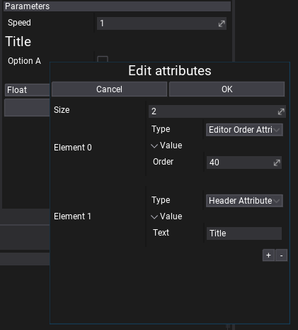

# Particle Parameters


Every particle emitter can define a custom set of parameters exposed publicly for additional customizations. Those parameters can be accessed per particle effect via particle system tracks names used as namespaces. For instance, if particle emitter has a single parameter named *Color* and particle system has 2 tracks with this emitter one named *Smoke 1*, second named *Smoke 2*, then you can adjust every one of those parameters independently: *Smoke 1.Color* and *Smoke 2.Color*.

Here is an example code that modifies the parameters. Remember to cache the effect parameters instead of querying them every frame so your game performance is better.

```cs
var effect = Actor.As<ParticleEffect>();

var color1 = effect.GetParam("Smoke 1", "Color");
color1.Value = Color.Red;

var color2 = effect.GetParam("Smoke 2", "Color");
color2.Value = Color.Blue;
```

In addition, you can enumerate all particle effect parameters as follows:

```cs
var effect = Actor.As<ParticleEffect>();
foreach (var param in effect.Parameters)
{
    Debug.Log("Param " + param.Name + " = " + param.Value);
}
```

## Attributes

Every parameter can have a collection of customizable **attributes** that can customize it's display logic in UI or be used as metadata for other systems (eg. serialization).

To add attribute to parameter simply **right-click -> Edit attributes**, then use **+** button to add new attribute, set **Type** to one of the items from the dropdown list, adjust properties of the atrtribute and hit **OK** to confirm.

For instance, Tooltip Attribute can be used to display documentation note abotu parameter for other users. Range and Slider attributes can help to customize editing scalar values and Ediotr Group and Editor Order can organize the list of parameters. To learn about attribute types see [this page](../scripting/attributes.md).


