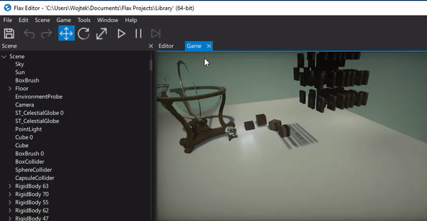

# Collisions



This page describes how to filter and detect objects collisions.

## Collisions filtering

Flax supports up to 32 different collision layers. Each layer can have different collisions mask defined globally.
You can use [Physics Settings](physics-settings.md) to define the layers collisions mask matrix.
Every actor has property [Actor.Layer](https://docs.flaxengine.com/api/FlaxEngine.Actor.html#FlaxEngine_Actor_Layer) which is used to peek the collisions mask for the object.

## Collisions detection

Flax uses event-based collisions detection. When the content between two objects is detected it gets reported during the **fixed update**. To access those events simply implement `OnCollisionEnter`/`/OnCollisionStay`/`OnCollisionExit` methods inside your script and attach it to the rigidbody or collider to fetch the events from its collisions.

Here is an example script that prints collision info to the log:

```cs
void OnCollisionEnter(Collision c)
{
    Debug.Log("New collision: " + c.ThisCollider.Name + " <-> " + c.OtherCollider.Name);

    for (int i = 0; i < c.Contacts.Length; i++)
        Debug.Log("Contact " + i + ": " + c.Contacts[i].Point);
}
```

To access information about the collision use [Collision](https://docs.flaxengine.com/api/FlaxEngine.Collision.html) class and [ContactPoint](https://docs.flaxengine.com/api/FlaxEngine.ContactPoint.html) structures.

See [Script Events](../scripting/events.md) page to learn more about the C# script events.


