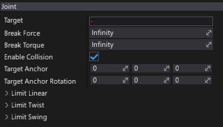

# D6 Joint

**D6 Joint** is the most customizable type of joint. This joint type can be used to create all other built-in joint types, and to design your own custom ones, but is less intuitive to use. Allows a specification of a linear constraint (for example for a slider), twist constraint (rotating around X) and swing constraint (rotating around Y and Z). It also allows you to constrain limits to only specific axes or completely lock specific axes.

## Properties

| Property | Description |
|--------|--------|
| **Target** | The target actor for the joint. It has to be **RigidBody** or **CharacterController**. |
| **Break Force** | Determines the maximum force the joint can apply before breaking. Broken joints no longer participate in physics simulation. |
| **Break Torque** | Determines the maximum torque the joint can apply before breaking. Broken joints no longer participate in physics simulation. |
| **Enable Collision** | Determines whether a collision between the two bodies managed by the joint is enabled. |
| **Target Anchor** | This is the relative pose which locates the joint frame relative to the target actor. |
| **Target Anchor Rotation** | This is the relative pose rotation which locates the joint frame relative to the target actor. |
| **Limit Linear** | Determines the linear limit used for constraining translation degrees of freedom. See [LimitLinear](https://docs.flaxengine.com/api/FlaxEngine.LimitLinear.html) to learn more. |
| **Limit Twist** | Determines the angular limit used for constraining the twist (rotation around X) degree of freedom. See [LimitAngularRange](https://docs.flaxengine.com/api/FlaxEngine.LimitAngularRange.html) to learn more. |
| **Limit Swing** | Determines the cone limit used for constraining the swing (rotation around Y and Z) degree of freedom. See [LimitConeRange](https://docs.flaxengine.com/api/FlaxEngine.LimitConeRange.html) to learn more. |

