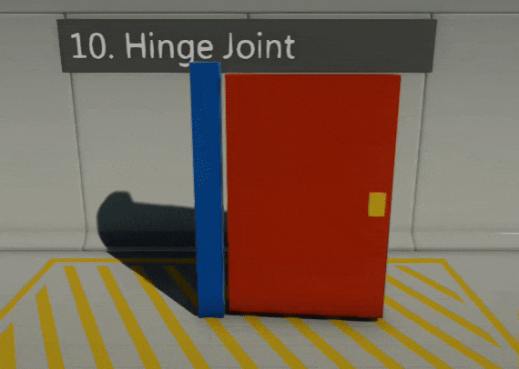

# Hinge Joint

**Hinge Joint** removes all but a single rotation degree of freedom from its two attached bodies (for example a door hinge).

## Properties

| Property | Description |
|--------|--------|
| **Target** | The target actor for the joint. It has to be **RigidBody** or **CharacterController**. |
| **Break Force** | Determines the maximum force the joint can apply before breaking. Broken joints no longer participate in physics simulation. |
| **Break Torque** | Determines the maximum torque the joint can apply before breaking. Broken joints no longer participate in physics simulation. |
| **Enable Collision** | Determines whether a collision between the two bodies managed by the joint is enabled. |
| **Target Anchor** | This is the relative pose which locates the joint frame relative to the target actor. |
| **Target Anchor Rotation** | This is the relative pose rotation which locates the joint frame relative to the target actor. |
| **Flags** | Controls joint behaviour. |
| **Limit** | Determines the limit of the joint. Limit constrains the motion to the specified angle range. You must enable the limit flag on the joint in order for this to be recognized. See [LimitAngularRange](https://docs.flaxengine.com/api/FlaxEngine.LimitAngularRange.html) to learn more. |
| **Drive** | Determines the drive properties of the joint. It drives the joint's angular velocity towards a particular value. You must enable the drive flag on the joint in order for the drive to be active. See [HingeJointDrive](https://docs.flaxengine.com/api/FlaxEngine.HingeJointDrive.html) to learn more. |

