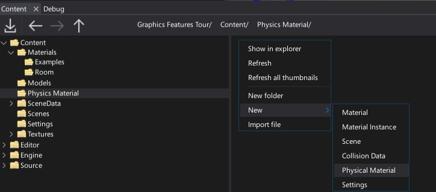
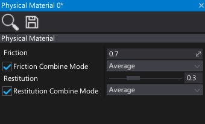

# Physical Material

The **Physical Material** asset is used to define the response of a physical object when interacting dynamically with the world.

## Create physical material

To create a new physical material asset, simply navigate to the Content directory in the *Content* window, then right-click and choose option **New -> Physical Material**. Specify its name and press *Enter*.

## Use physical material

Physical materials are used by the colliders to define their surface properties. You can set the collider material by dragging the asset right into the **Material** property. Alternatively, you can modify the material at runtime using C# API (see [Collider.Material](https://docs.flaxengine.com/api/FlaxEngine.Collider.html#FlaxEngine_Collider_Material) property).

## Properties

| Property | Description |
|--------|--------|
| **Friction** | The friction value of surface, controls how easily things can slide on this surface. The default value is `0.7`. |
| **Friction Combine Mode** | The friction combine mode, controls how friction is computed for multiple materials. Possible options: <table><tbody><tr><th>Option</th><th>Description</th></tr><tr><td>**Average**</td><td>Uses the average value of the touching materials: (a+b)/2.</td></tr><tr><td>**Mininum**</td><td>Uses the smaller value of the touching materials: min(a,b).</td></tr><tr><td>**Multiply**</td><td>Multiplies the values of the touching materials: a\*b.</td></tr><tr><td>**Maximum**</td><td>Uses the larger value of the touching materials: max(a, b).</td></tr></tbody></table>|
| **Restitution** | The restitution or 'bounciness' of this surface, between 0 (no bounce) and 1 (outgoing velocity is same as incoming). The default value is `0.3`. |
| **Restitution Combine Mode** | The restitution combine mode, controls how restitution is computed for multiple materials. Possible options: <table><tbody><tr><th>Option</th><th>Description</th></tr><tr><td>**Average**</td><td>Uses the average value of the touching materials: (a+b)/2.</td></tr><tr><td>**Mininum**</td><td>Uses the smaller value of the touching materials: min(a,b).</td></tr><tr><td>**Multiply**</td><td>Multiplies the values of the touching materials: a\*b.</td></tr><tr><td>**Maximum**</td><td>Uses the larger value of the touching materials: max(a, b).</td></tr></tbody></table>|
