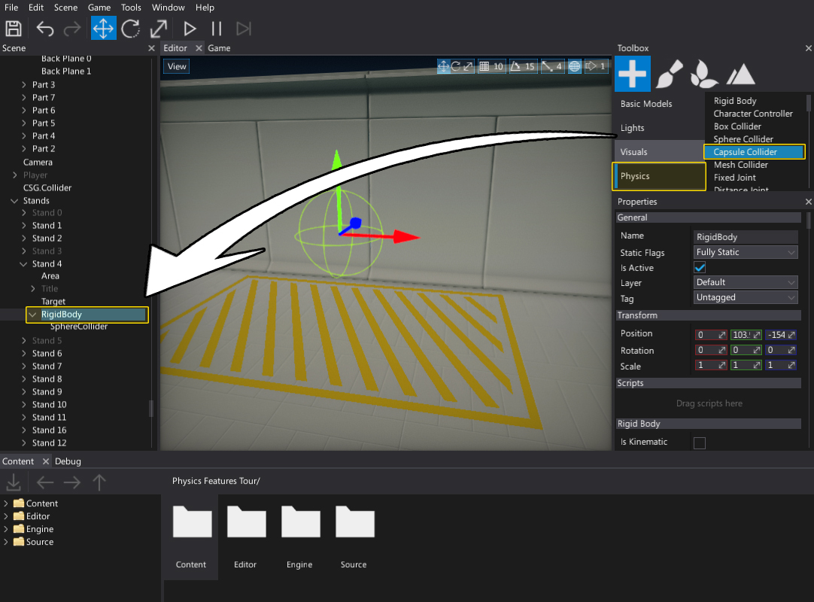
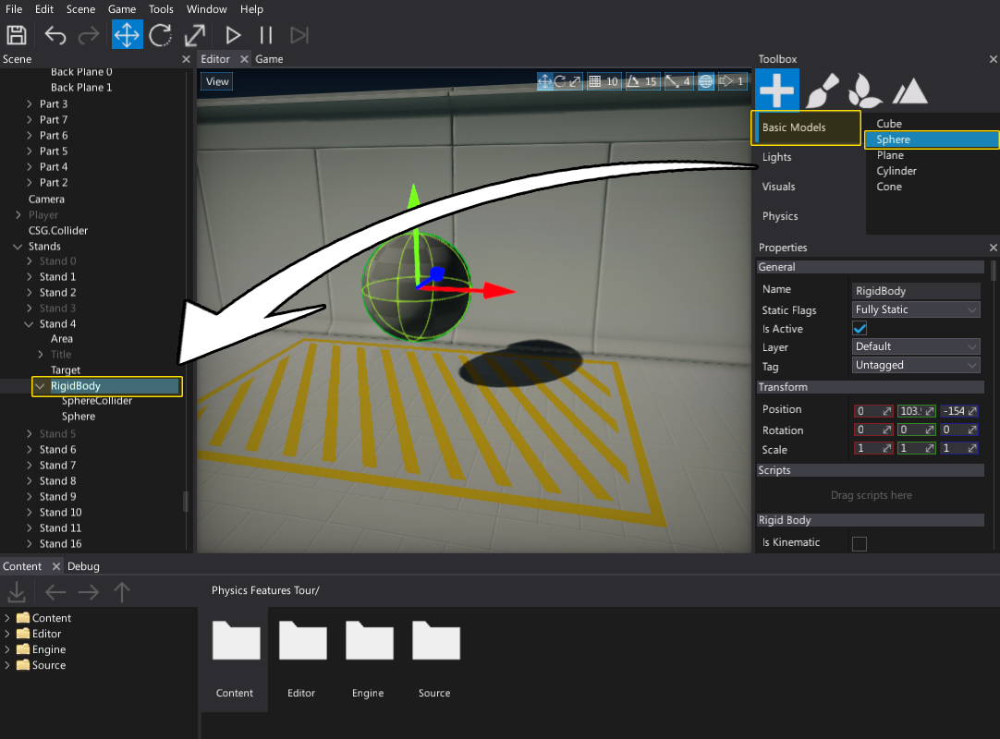
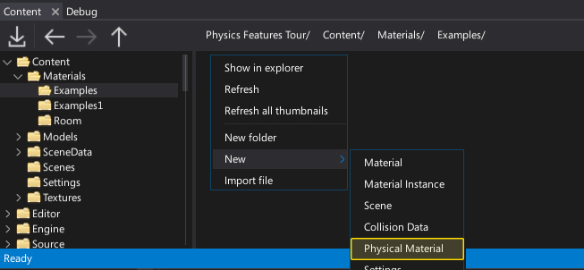
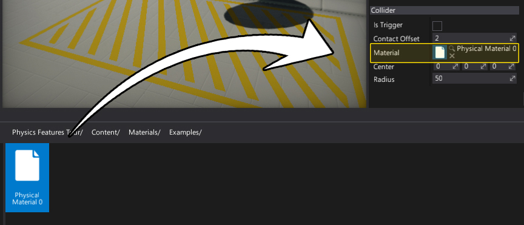

# HOWTO: Create a bouncing ball

In this tutorial you will learn how to create and use a rigid body with a collider and physical material create a bouncing ball.

See [Rigid Bodies](../rigid-bodies.md) page to learn more about rigid bodies.

## 1. Create a rigidbody

Firstly we need to spawn a rigidbody and place it somewhere in the level. Use a *Toolbox* window (*Physics* section) or a *Scene* window context menu.

## 2. Add collider and model

Add **Sphere Collider** actor and **Sphere Model** to rigidbody (as children) to it will have a physical shape along with a visual representation.

To do so use *Toolbox* window and drag and drop into the Rigidbody actor in a *Scene* window:

* Drag and drop a **Sphere Collider** from the **Physics** section

* Drag and drop a **Sphere** from the **Basic Models** section

## 3. Create a physical material

Use the *Content* window to create a new physical material asset. Right-click and select option **New -> Physical Material**. Specify its name and hit *Enter* to confirm.

Open created asset (double click on it) and set the **Restitution** to `1` so ball will bounce more. Remember to save the asset using *disk* icon.

## 4. Asign material to the collider

Drag and drop the created physical material into the **Material** property of the ball collider.

## 5. Test it out!

Hit **Play** button and test the bouncing ball. You can use the same physical material on a floor to simulate more bounces.

