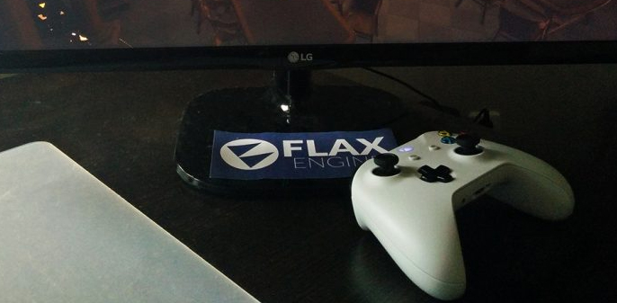

# Platforms

Flax is a **cross-platform game engine**. It means you can create your game once and deploy to many platforms at once. The engine itself takes care of platform differences, graphics backends, and scripting environment. This helps with games development and it one of the essential parts of the game engines.

This section covers the specific information for different aspects of each platform.

## Supported platforms

* [Windows Desktop 7, 8, 10](windows.md)
* [Universal Windows (UWP)](uwp.md)
* [Xbox One](xbox-one.md)
* [PlayStation 4](ps4.md)
* [Linux](linux.md)
* [Xbox Scarlett](xbox-scarlett.md)
* [Android](android.md)

> [!TIP]
> To check on which platform game is running use [Platform.Platform](https://docs.flaxengine.com/api/FlaxEngine.Platform.html#FlaxEngine_Application_Platform). You can also use [preprocessor variables](../scripting/preprocessor.md) in your code.

## Supported graphics backends

* DirectX 11 (with DirectX 10/10.1 fallback)
* DirectX 12
* Vulkan
* Null
* Platform native (eg. on PS4)

> [!TIP]
> To check on which rendering backend game is running use [GPUDevice.Instance.RendererType](https://docs.flaxengine.com/api/FlaxEngine.GPUDevice.html#FlaxEngine_Rendering_GPUDevice_RendererType). You can also use [GPUDevice.Instance.ShaderProfile](https://docs.flaxengine.com/api/FlaxEngine.GPUDevice.html#FlaxEngine_Rendering_GPUDevice_ShaderProfile) to check the shaders format that is being used by the rendering backend.

## Built game logs

By default Flax stores log files inside the project folder in subdirectory `Logs` (as described [here](../get-started/project-structure.md)). However, the built game is often installed in a folder with no write-access which means Flax needs to store the log files in a temporary directory located in `%LocalAppData%\<CompanyName>\<ProductName>`. Where `<CompanyName>` and `<ProductName>` are values defined in the *Game Settings*. Use these log files to debug your built game crashes or errors.

## Crash logs

Debug and Development builds support crash dumps collecting (depending on the target platform). By default crash dump is created in Logs folder in a directory named `Crash_<log_name>` and it contains a copy of the original log file and memory dump.
For instance, on Windows you can open minidump file with Visual Studio, specify the engine/game binaries (with .pdb files) and debug the native crash
