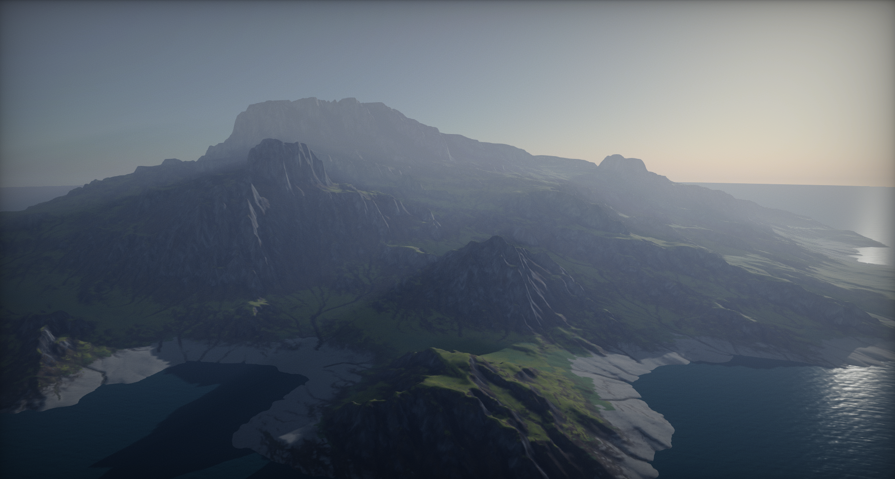
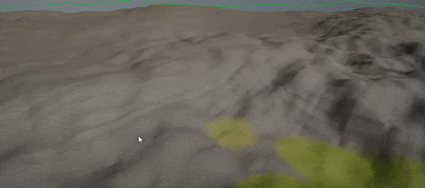
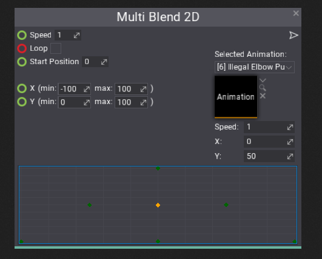
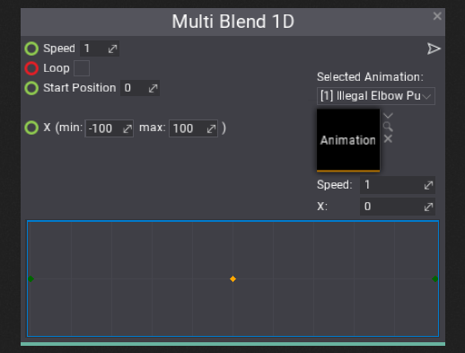
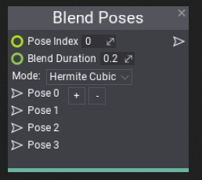
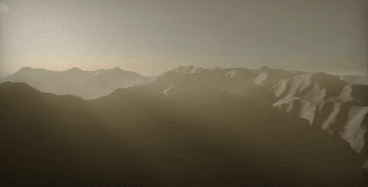

# Flax 0.3 release notes

## Highlights

### Terrain



We've added **Terrain** to Flax! This includes not only terrain importing and rendering but also full collsiions support, holes in terrain support, advanced terrain generation from heightmaps and splatmaps, terrain live modifications and painting in Editor with full undo support. We've added new material domain type dedicated for terrain and added support for generating terrain at runtime.

Terrain is using **Continuous LOD** system with streaming which enables to create very large landscapes and render them at high view distances with no performance drop. Under the hood, Terrain actor uses a collection of patches, where each patch contains a quad of 4×4 chunks. Size of the chunk is adjustable per terrain and by default, we use the value of 127. This allows Flax to efficiently cull and draw only visible chunks with smooth LODs transitions (no cracks or visual artifacts on different LOD edges).


Terrain can be imported from external tools as a heightmap with a collection of splatmaps or created right in the Editor using the terrain sculpting tools. Flax Editor support using simple carving brush, smoothing brush, noise brush, and flatten brush. Full undo-redo support and intuitive editing tools make it very nice to modify the terrain right inside the editor. Flax supports also creating holes in terrain for caves and tunnels (including proper collisions handling).



To learn more about terrain see the related documentation [here](../../terrain/index.md).

### Anim Graph State Machines


We keep improving **Anim Graph** to enable developers to create even more realistic and unique animated models. In this update, we've shipped many exciting featured for Anim Graph including **State Machines** support. Using State Machines is a very common technique creating characters animations blending graph and now can be also used in Flax. Alongside this feature we've added a series of new nodes to the Anim Graph to helps using this feature such as value comparison nodes, boolean math nodes, bitwise inteager math nodes and more.

To learn how to create state machine see [this tutorial](../../animation/tutorials/setup-state-machine.md).

### Editor Improvements

Flax Editor is a great collection of tools but we cannot stop improving it. In this update we've focused on improving overall productivity by adding features such as:
* Modified properties highlight and revert to default value
* Read-only script properties support
* Resizing texture on import
* Source Code editor option and C# API for other IDE integrations
* Undo/redo support to Material Instance editor window
* Highlighting modified material instance parameters (compared to base material)
* and more...

### Model LOD Improvements


Now, Flax supports **Dithered LOD Transition** and advanced model LODs configuration. We've added `LOD Bias` and `Forced LOD` properties to models (and even terrain itself). This enabled developers to adjust the model visual quality to match the desired effect. You can also control the LODs per scene view by using a dedicated C# API.

Model Asset Window contains an option to preview a selected LOD.

### Multi Blend nodes in Anim Graph

We've added more blending nodes to Anim Graph that can be used to achieve more advanced setup of model animations blending.

##### Multi Blend 2D

Blend up to 14 different animations in 2D space. This node can be very useful to implement player locomotion animations blending or to create character aiming blending.



##### Multi Blend 1D

Multi Blend 1D node works similar to Multi Blend 2D except it uses simplified single axis for blending. It's more optimized and can be used for player crouching forward or left or right animations blending.



##### Blend Poses

In some cases it may be useful to play character animation selected by the pose index (random or provided by the parameter). For instance, you can play a player death animation by selecting a one from a set of various possible death type animations. This node offers also blending between two animations on selected pose change so the transition can be smooth.



### Open World Optimizations



Creating terrain system was not enough to enable developers to create huge worlds. While Flax rendering pipeline is already quite optimized for big scenes we applied more optimizations to CPU rendering code and scene ticking code to make it run even faster. This results in **great performance** and **less memory usage**. Scene objects culling has been improved (using *Radix* sort and better data locality). Draw calls sorting is not only faster but Flax does not allocate any memory during scene rendering.

### Scripting Improvements

Alongside the Editor improvements, we keep adding more features to the C# scripting API. Now you can use `Int2`, `Int3` and `Int4` types in your code for integer-type vectors. Flax will also display them in a proper way in Editor. We've improves scripts update logic so if your game doesn't use many scripts but has large scenes you will see a significant performance improvement.

Now, you can also use **default value** for your properties. The dedicated attribute is not integrated into the editor and helps with scripts properties editing. See the following example code:

```cs
[DefaultValue(3.14f)]
public float MyValue;

[DefaultValue(typeof(Vector2), "1,2")]
public Vector2 StartPosition;
```

You can also use **read-only** values attribute for value-preview only purpose:

```cs
[ReadOnly]
public Int2 MyValue2;
```

Finally, we've exposed even more Editor C# API to the public so plugins can integrate with it even more and extend in future.

### `ModelActor` renamed to `StaticModel`

The last very important change to mention is the **ModelActor** name refactor. Now it has type name **StaticModel**. We've decided to rename it early now to match the naming convention (as *AnimatedModel* type) and make it more related to its actual behavior: it's non-animated, static geometry model. To match this change you will be required to update you game scripts and code to match the new type. All your scenes and assets should not be affected by this change (except minor cases of usage in Json assets that requires manual fixing). We've also updated our *FlaxSamples* so you can grab the updated project to try the out.

We just want to remember that during **Alpha** releases we still may introduce breaking changes to naming or data so please keep in mind that many engine parts may be still subject to change. However, it's not likely to be done since we want to stabilize the engine before **Beta** release.

## Changelog

### Version 0.3.6175 - 28 December 2018

* Add support for wireframe GUI material
* Fix depth clipping for GUI materials
* Fix Windows version detection for Windows 8.1
* Fix game window focus on mouse down when using UICanvas in game viewport
* Fix crash after creating new scene and opening game settings asset
* Fix handling Scripts implemented as nested classes
* Fix crash on scripts reload in editor when using `XmlQueryType`
* Fix drawing TextRender when using characters from different texture atlases
* Fix enabling/disabling scene objects in more complex usage cases
* Fix default values for ToneMap_WhiteTint and ToneMap_FilmBlackClip
* Fix ray intersection test for `StaticMode` meshes
* Fix typo in `ThumbnailRequest.States` enum
* Fix crash when loading script that is not a valid script type anymore
* Fix plugin assembly name validation and add more useful error messages
* Fix exporting plugin after changing its name
* Fix System.Version serialization to Json
* Fix debug log messages overflow by clipping too long text

### Version 0.3.6174 - 18 December 2018

* Add Capsule to basic models toolbox in editor
* Add **content searching with filters**
* Add **scene and prefab hierarchy searching**
* Add content folders hierarchy searching
* Add `AnimatedModel.ResetAnimation`
* Add C# API for extracting audio data from AudioClip (internal format, raw PCM or normalized float)
* Add `Application.VirtualDesktopBounds`
* Add support for drawing **audio clips previews** and thumbnails
* Add expand all and collapse all to content and scene tree context menus
* Add Editor undo limit support to options
* Add double-click option to import assets settings window to rename the designation filename
* Add context menu for import file dialog entries (rename, remove, show in explorer)
* Add restoring editor selection on scripts reload
* Add support for using virtual assets in AssetPicker
* Add option to show floor model in animated model and model windows previews
* Add dock panel windows context menu for quick closing windows
* Add button for adding/removing new items to collection in editor
* Add move up/down buttons to collection property items labels
* Add support for saving and restoring **workspace layout slots**
* Fix HistoryStack leaks on buffers overflow
* Fix editor windows layout loading for some specific windows setup for virtual desktop environment
* Fix building CSG mesh during play mode (disabled to prevent issues)
* Fix screenshots brightness
* Fix editor atlas missing icons
* Fix crash on one of the sample projects
* Fix character controller move filter for rare issues while moving
* Minor fixes

### Version 0.3.6173 - 9 December 2018

* Fix using custom SSE Intel instructions for float to/from half data conversion
* Rebuild UWP dependencies libraries to use v141 toolset and Windows 10 SDK 10.0.17134.0
* Remove VC++ 2015 redistribute libs from Flax binaries (launcher installs them if missing, the game has to package them on its own as documentation states)

### Version 0.3.6172 - 4 December 2018

* Fix materials loading issue
* Fix missing terrain assets for editor

### Version 0.3.6171 - 4 December 2018

Contributors: stefnotch

* Add **Terrain** system
* Rename **ModelActor** to **StaticModel**
* **Anim Graph state machines** with custom transitions and blending between states
* Add Terrain Carving Tools to editor toolbox window
* Add **State Machine** node to Anim Graph
* Add support for subgraphs in Visject Surface
* **Optimize rendering** and **improve performance in huge worlds** (CPU side, GPU side was already blazing fast)
* Add `Vector2.Perpendicular`
* Add `Vector2.Cross`
* Add Editor C# API for importing files from code without options dialog popup
* Add `EnumDisplayAttribute` for custom enum items display mode in Editor
* Add Int2, Int3, Int4 editors
* Allow mixing material layers using different domain materials (eg. Surface material in Terrain)
* Add **XAudio2** support for UWP and Xbox One
* Add support for importing .RAW files (16-bit, grayscale in little-endian byte order, square dimensions)
* Add support for resizing texture on import to a custom value
* Add **Interpolate VS To PS** node to materials
* Add `LOD Bias` and `Forced LOD` to *Model*
* Add `Model LOD Bias` and `Model LOD Distance Factor` to *RenderView*
* Add debugging single model LOD in Model Window in Editor
* Add `Local` space transformation in materials (aka object space)
* Add undo/redo support to Material Instance editor window
* Add support for layered materials with blended displacement and tessellation factor
* Add **Use Dithered LOD Transition** option to materials for smoother LOD transitions
* Add *Use Input World Space Normal* option to materials
* Add Draw Time chart to profiler main page
* Add `GraphicsDevice.VendorId` and `GraphicsDevice.Description` to C# API
* Add caching editor viewport properties in windows layout
* Add validation for model LODs Screen Size sequence (warns on error)
* Add pack/unpack material layer nodes with world displacement and tessellation multiplier
* Add **Multi Blend 2D** node to Anim Graph
* Add **Multi Blend 1D** node to Anim Graph
* Add **Blend Pose** node to Anim Graph
* Add Anim Graph nodes for get/set/add root motion
* Add floor model to Anim Graph animation preview
* Add closing import dialog on escape key and import on enter
* Adjust model preview lighting  in editor
* Add *Boolean* math nodes to Anim Graph (boolean math)
* Add *Bitwise* operations to Anim Graph (integer math)
* Add *Comparisons* operations to Anim Graph (values comparing)
* Add *Near Equal* method to Anim Graph math library
* Add shortcut for renaming content folders in tree view with F2 key
* Add option to drag and drop items using content window navigation buttons
* Add option to delete or duplicate folder in workspace tree view
* Add selecting textbox range with Shift key being pressed
* Add navigation with keyboard arrows in viewport without mouse captured
* Add navigation between profiler frames using keyboard arrows
* Add Reset to default option for custom editor property context menu
* Add default value attribute for various asset import options and engine types
* Add default values for material instance parameters (from base material)
* Add support for properties copy/paste in editor
* Add improvements to Visject Surface context menu
* Add `TextRender.LocalBox`
* Add Near Plane setting to editor viewports
* Add more editor camera speed factors
* Add default values to PostFxSettings for easier editing
* Add `Blur Strength` property to Depth Of Field settings
* Add *Focus Game Win On Play* to editor options
* Add default value restoring option to editor options
* Add support for virtual CollisionData asset and cooking mesh collision at runtime
* Add support for choosing an animation clip index to import from source file
* Add support for Pause button in game view to pause gameplay
* Add `RigidBody.ClosestPoint`
* Add `RigidBody.AddRelativeForce` and `RigidBody.AddRelativeTorque`
* Add `ReadOnly` attribute and support for it in editor
* Adjust limits for various properties for better usage when adjusting for the big scenes
* Improve dynamic box types update and boolean value editing for Visject Surface nodes
* Upgrade Xbox One Win 10 SDK to *10.0.17763.0*
* Improve Windows Driver Kit (WDK) install location finding for tools used by UWP/XboxOne deployment
* Improve streamable audio sources buffers queue submission
* Refactor source code editors, add support for custom source code editing plugins
* Use white color as default vertex color when none binded
* Use string.Empty for converting empty c++ string to c# world
* Remove camera far plane limit
* Add source code editor option in Editor
* Optimize serialization
* Fix updating dependent boxes types on Visject Surface load
* Fix AssetPicker focus on some actions
* Fix main material node boxes update
* Fix settings material parameter using double value type to float or int parameter
* Fix material generator material features flags gather for layered materials
* Fix render viewport properties setup for shadow passes
* Fix various typos and improve code documentation
* Fix bool type param get node init (in Visject Surface)
* Fix color for Bool type boxes in Visject Surface
* Fix crash for prefab apply with removed objects from prefab
* Fix audio source velocity update
* Fix audio clip quality option restoring on reimport
* Fix Xbox One support
* Fix rare text layout calculating issues for words wrapping option enabled
* Refactor material parameters gather in vertex shader to be more optimized (better instructions reusing)
* Refactor scene rendering (linear list of geometry instances instead of tree traversal)
* Refactor UI window mouse events
* Optimize float/half transformation using SIMD
* Disable per mesh culling during model drawing
* Optimize draw calls sorting (use radix sort and better data locality to reduce cache misses)
* Optimize writing to instance buffer
* Optimize scene ticking
* Draw animation filename in thumbnail
* Don't rebuild Visject param get node boxes on value change if param type is the same
* Optimize visject graph backend (reduced amount of dynamic memory allocations and faster graph processing times)
* Reduce thread locks in render code
* Prevent drawing 2 or more frames in a row without update or fixed update
* Allow to model LOD Screen Size be higher than 1
* Remove `ViewFlags.DynamicActors`
* Fix `VisibleIf` attribute processing
* Fix Actor.LocalToWorldMatrix getter
* Fix Screen.Size in editor when game window is not selected
* Fix editing script reference property via drag in editor
* Fix `Actor.LookAt` in certain cases
* Fix minor memory leaks on engine exit
* Fix baking lightmap for scenes with many lightmaps required
* Fix combobox crash with anim graph bone picker controls
* Fix engine startup crash when no audio devices found
* Fix crash when playing audio without audio devices
* Fix motion vectors rendering for objects linked to Bone Socket actor
* Fix minor bug with visject value parsing with regex
* Fix parameter get Visject node if one of the params is invisible to UI
* Maaaaaany fixes (oh sooo many)

