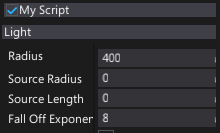
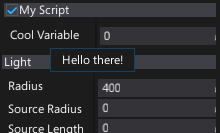
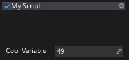
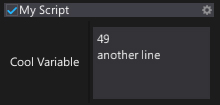
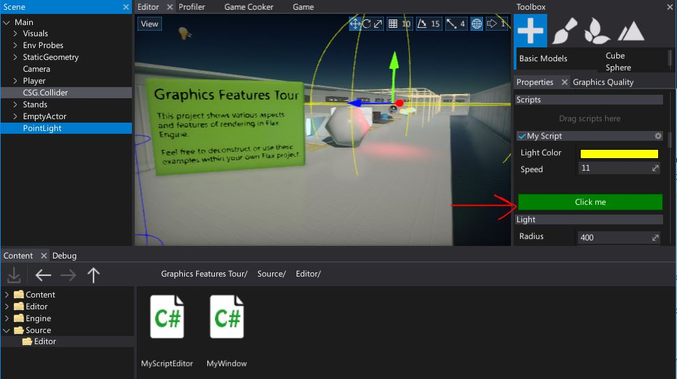

# Custom editors attributes

This page lists all common attributes that are used by the Custom Editors pipeline. Each attribute comes up with a short explanation and the usage example.

### HideInEditor

Makes a variable not show up in the editor.

```cs
[HideInEditor]
public int CoolVariable;
```



### Tooltip

Specifies a tooltip for a property/field in the editor. Useful to provide documentation for object properties.

```cs
[Tooltip("Hello there!")]
public int CoolVariable;
```



### Limit

Used to make a float or int variable in a script be restricted to a specific range.

```cs
[Limit(0, 100, 0.1f)]
public int CoolVariable;
```

### Range

Used to make a float or int variable in a script be restricted to a specific range. When used, the float or int will be shown as a slider in the editor instead of default number field.

```cs
[Range(0, 100)]
public int CoolVariable;
```


### Header

Inserts a header control with a custom text into the editor layout.

```cs
[Header("Super Section")]
public int CoolVariable;
```


### Space

Inserts an empty space between controls in the editor.

```cs
[Space(50)]
public int CoolVariable;
```



### EditorDisplay

Allows to change item display name or a group in the editor.

```cs
[EditorDisplay(null, "Override Label")]
public int CoolVariable;
```


### EditorOrder

Allows to declare order of the item in the editor. Items are listed from the lowest to the highest order.

```cs
[EditorOrder(-10)]
public int CoolVariable;
```

### MultilineText

Instructs UI editor to use multiline textbox for editing *string* property or field.

```cs
[MultilineText]
public string CoolVariable;
```



### AssetReference

Specifies a options for an asset reference picker in the editor. Allows to customize view or provide custom value assign policy.

```cs
[AssetReference(useSmallPicker: true)]
public Texture CoolVariable;
```


### MemberCollection

This attributes provides additional information on a member collection.

```cs
[MemberCollection(ReadOnly = true)]
public int[] CoolVariable = new int[]
{
	1,
	2,
	3,
};
```


### CustomEditor

Overrides the default editor provided for the target object/class/field/property. Allows to extend visuals and editing experience of the object.

```cs
[CustomEditor(typeof(MyScript))]
public class MyScriptEditor : GenericEditor
{
	public override void Initialize(LayoutElementsContainer layout)
	{
		base.Initialize(layout);

		layout.Space(20);
		var button = layout.Button("Click me", Color.Green);
		button.Button.Clicked += () => Debug.Log("Clicked!");
	}
}
```



### CustomEditorAlias

Works the same as *CustomEditor* attribute, except uses a typename that can be located in different assembly (not referenced).

```cs
[CustomEditorAlias("MyScriptEditor")]
public class MyScript : Script
{
	public float Speed = 11;
	public Color LightColor = Color.Yellow;
}
```

