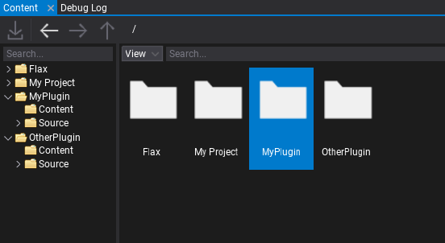

# Plugin Project

Flax supports references between projects including nested projects hierarchies. This concept is even used in-game projects to reference engine project. In this documentation section, you will learn how to reference and use the plugin project in your game project.

Create a new project and add it to your existing **project workspace subdirectory**. For instance, place it in the `Plugin/<plugin_name>` folder. You can also use an [example plugin](https://github.com/FlaxEngine/ExamplePlugin) project to do this.

Then, add **reference** from your game project to the added plugin project. Simply open **<project_name>.flaxproj** with a text editor and add reference to the plugin project:

```
	"References": [
		{
			"Name": "$(EnginePath)/Flax.flaxproj"
		},
		{
			"Name": "$(ProjectPath)/Plugins/MyPlugin/MyPlugin.flaxproj"
		}
	],
```

As you can see, by using `$(ProjectPath)` followed by the local path you can reference the plugin project file directly. Then you can open the editor and use content and scripts from the plugin project in your game.

If you want to reference the types from referenced project code modules simply add reference in your game code module build script (in `Setup` function):

```cs
options.PrivateDependencies.Add("MyPlugin");
```

Also, plugin projects can also reference other projects but cross-project references are not supported.


