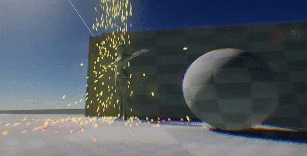

# HOWTO: Control PostFx from code

### 1. Create PostFx Volume

Firstly, create or use your PostFx Volume actor. This special object type contains a collection of post-process options that can be used to override the default rendering and customize it by your game logic. Set **Is Bounded** to **false** so your volume will affect the whole scene.

### 2. Create script

Create a new script and add code that performs the simple animation of one of the postFx settings. You can basically edit any of them. Just remember to specify the override flags for the customized properties.

```cs
public class PostFxControl : Script
{
    public override void OnUpdate()
    {
        // Get parent PostFxVolume actor (actor should be linked to it)
        var postFx = Actor.As<PostFxVolume>();

        // Get current options
        var camArtifacts = postFx.CameraArtifacts;

        // Override ChromaticDistortion field
        camArtifacts.OverrideFlags = CameraArtifactsSettings.Override.ChromaticDistortion;
        camArtifacts.ChromaticDistortion = (Mathf.Sin(Time.GameTime * 2.0f) * 0.5f + 0.5f) * 4.0f;

        // Set new options
        postFx.CameraArtifacts = camArtifacts;
    }
}
```

### 3. Test it out!

Finally, add the script to the created PostFx Volume actor on the scene. Then start the game and test the result.



