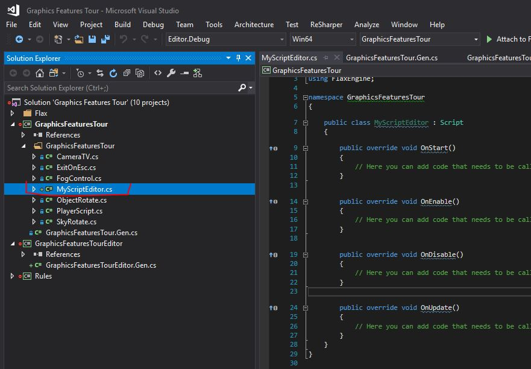
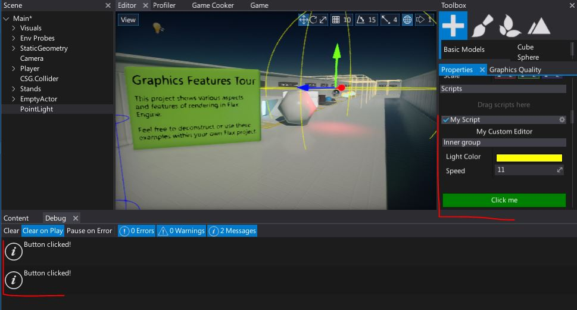

# HOWTO: Create a custom editor

In this tutorial you will learn how to create a simple custom editor for the script. To learn more about Cutom Editors pipeline see related documentation [page here](../custom-editors/index.md).

### 1. Prepare a sample script (or use one from your game)

```cs
public class MyScript : Script
{
    public float Speed = 11;

    public Color LightColor = Color.Yellow;

    public void Start()
    {
    }
}
```

### 2. Create `Editor` folder in `Source` directory

Flax generates two projects for your game scripts. The first for the actual gameplay (the main project), and the second one for the editor plugins and extensions. Files located in `Editor` folders (eg. *Source/Player/Ammunition/Editor*) are included in editor-related project while the rest is in the main project.


### 3. Create editor script

Create a new C# script inside the `Source/Editor` directory and use the target class name with *Editor* prefix.


### 4. Open file

Double-click on created file to open it in code editor.



### 5. Implement the custom editor

Edit created class to inherit from [GenericEditor](https://docs.flaxengine.com/api/FlaxEditor.CustomEditors.Editors.GenericEditor.html). Add [CustomEditor](https://docs.flaxengine.com/api/FlaxEngine.CustomEditorAttribute.html) attribute that will tell Flax to use this type for editing `MyScript` objects. Implement the `Initialize` function which creates the editor layout. In the example below it inserts a label, creates a group with default editor inside and then adds a button after a small space.

```cs
using FlaxEditor.CustomEditors;
using FlaxEditor.CustomEditors.Editors;
using FlaxEngine;

namespace GraphicsFeaturesTour
{
    [CustomEditor(typeof(MyScript))]
    public class MyScriptEditor : GenericEditor
    {
        public override void Initialize(LayoutElementsContainer layout)
        {
            layout.Label("My Custom Editor", TextAlignment.Center);
            var group = layout.Group("Inner group");

            base.Initialize(group);

            layout.Space(20);
            var button = layout.Button("Click me", Color.Green);
            button.Button.Clicked += () => Debug.Log("Button clicked!");
        }
    }
}
```

### 6. See the results

After Flax reloads the scripts, select the object with `MyScript` added and see the custom editor as shown in the picture below.



When clicking the button it prints *"Button clicked!"* in a *Debug* window, as expected.

