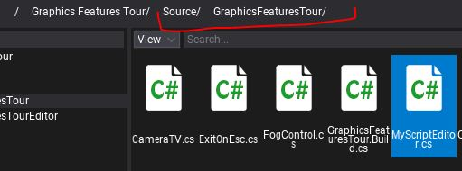
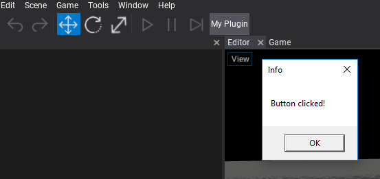

# HOWTO: Create a custom editor plugin

Editor plugins can extend the Flax Editor or implement a proper tooling for the related game plugins that they are shipping with.

> [!Note]
> Note: if your plugin uses both **Game Plugin** and **Editor Plugin** types the remember to implement `EditorPlugin.GamePluginType` to point the type of the game plugin.

### 1. Create editor script

Create a new C# script named **MyEditorPlugin** inside the `Source/<module_name>` directory and use the target class name with *Editor* postfix. Alternatively, you can use an additional editor-only scripts module as shown in tutorial [here](add-scripts-module.md).



### 2. Implement plugin logic

Next step is to implement the actual logic of the plugin. Editor plugins can access whole C# API including Editor API. Use it to extend the default editor functionalities or create new ones.

Here is a sample code that adds a new button to the editor toolstrip and shows the message when a user clicks on it.
**Remember to clean up created GUI elements on editor plugin deinitialization!**

```cs
#if FLAX_EDITOR
using FlaxEditor;
using FlaxEditor.GUI;
using FlaxEngine;

namespace ExamplePlugin
{
    public class MyEditorPlugin : EditorPlugin
    {
        private ToolStripButton _button;

        /// <inheritdoc />
        public override void InitializeEditor()
        {
            base.InitializeEditor();

            _button = Editor.UI.ToolStrip.AddButton("My Plugin");
            _button.Clicked += () => MessageBox.Show("Button clicked!");
        }

        /// <inheritdoc />
        public override void Deinitialize()
        {
            if (_button != null)
            {
                _button.Dispose();
                _button = null;
            }

            base.Deinitialize();
        }
    }
}
#endif
```


Flax plugins use two main methods for the lifetime: `Initialize` and `Deinitialize`. However for Editor plugins when `Initialize` is called the Editor may still be uninitialized so it's better to use `InitializeEditor` to add custom GUI to the Editor.

### 3. Test it out

Go back to the Editor, wait for scripts recompilation and see the custom button is added. Click it to see the popup we have implemented. Now you are ready to implement more cool features to the editor.


