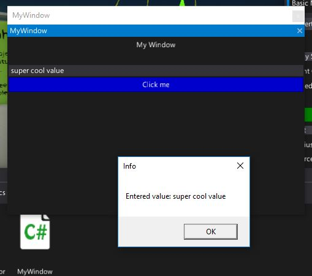

# HOWTO: Create a custom editor window

In this tutorial you will learn how to extend the Flax Editor by creating a fully customized tool window.

Flax Editor supports two basic types of window
* *Native window* - uses C# UI to setup the GUI
* *Custom Editor window* - uses [Custom Editors](../custom-editors/index.md) pipeline to set up the GUI

This tutorial covers how to create the second one.

### 1. Prepare a sample script with a custom editor (or use one from your game)

To show custom editor window we will use a custom editor with a button.
To learn more about it see tutorial [HOWTO: Render create a custom editor](custom-editor.md).

Game script example:

```cs
public class MyScript : Script
{
    public float Speed = 11;

    public Color LightColor = Color.Yellow;

    public override void OnStart()
    {
    }
}
```

Custom Editor example:

```cs
[CustomEditor(typeof(MyScript))]
public class MyScriptEditor : GenericEditor
{
    public override void Initialize(LayoutElementsContainer layout)
    {
        base.Initialize(layout);

        layout.Space(20);
        var button = layout.Button("Click me", Color.Green);
        button.Button.Clicked += () => Debug.Log("Button clicked!");
    }
}
```

### 2. Create a new script

Navigate to `Source/Editor` directory and create new `MyWindow` script.


### 3. Implement editor window

Open a code editor and write the following code of the editor window. It should implement [CustomEditorWindow](https://docs.flaxengine.com/api/FlaxEditor.CustomEditorWindow.html) class. Note that it requries to override `public override void Initialize(LayoutElementsContainer layout)` function similar to custom editors.

```cs
public class MyWindow : CustomEditorWindow
{
	private TextBoxElement textbox;

	public override void Initialize(LayoutElementsContainer layout)
	{
		layout.Label("My Window", TextAlignment.Center);
		layout.Space(20);
		textbox = layout.TextBox();
		var button = layout.Button("Click me", Color.Blue);
		button.Button.Clicked += OnButtonClicked;
	}

	private void OnButtonClicked()
	{
		MessageBox.Show("Entered value: " + textbox.TextBox.Text);
	}
}
```

### 4. Add code to show a window

Navigate to `MyScriptEditor` and modify the green button click event handler. It should create new window and show it to the user.

```cs
button.Button.Clicked += () => new MyWindow().Show();
```

### 5. See the results

Go back to editor, wait for scripts reload and select object with `MyScript` attached.


Then press the button. Your custom window should show up. It works like other editor window so you can drag and dock it or move it around.


Now write something in the text box and click the blue button to see the message box with the entered text. If you want to close this window just click the cross icon in the upper right corner.




