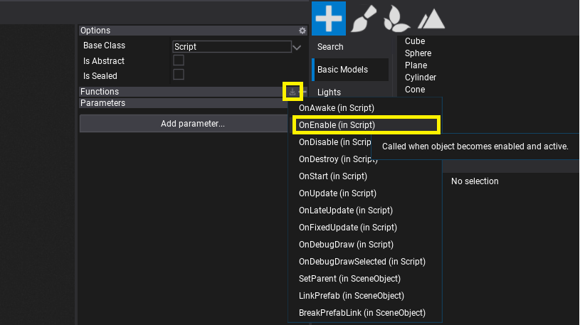
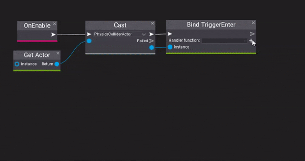
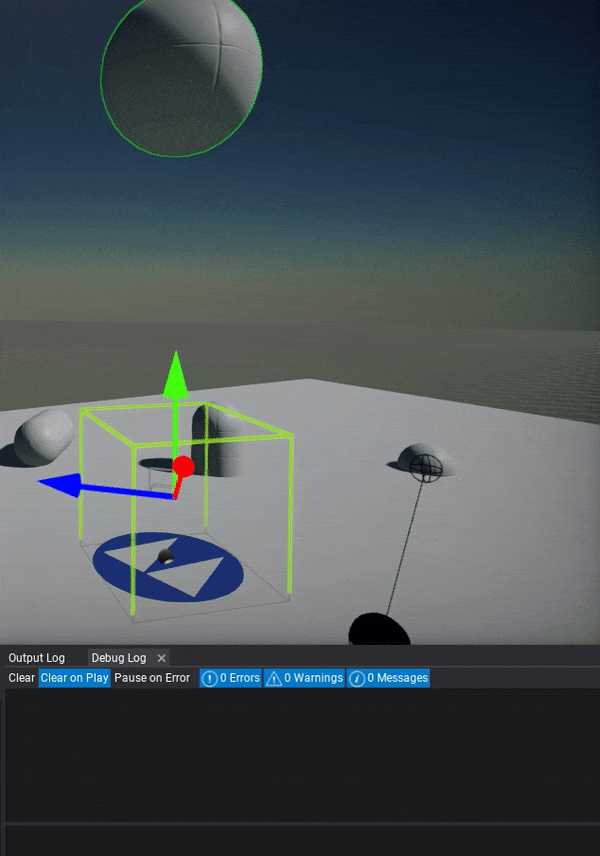

# Events in Visual Scripts

**Visual Scripting** supports binding for various events for easier gameplay scripting. Follow this documentation page to learn how to use them in your project.

## How to handle trigger event?

Onve you've created Visual Script use **Bind XXX** node to register custom function for event that will be executed every time event gets called. Flax supports registering member or static functions to member and static events.

Firstly, **override OnEnable** method.

Then use **Get Actor** node from **Script** class and **Cast** node to cast it to **PhysicsColliderActor**.

Now, add **Bind TriggerEnter** method and connect it to Cast outputs. We will use it to register for trigger collider to call our function every time something enters the trigger.

As you can see it shows the handler function dropdown menu as disabled which means there ar eno valid functions on a graph to call for event. Let's **use red button** to quickly create new event handler function and use it in that bind node.

After that you can use this function to perform any custom logic every time this collider gets triggered. In this example we simply print the custom message with the object name that activated the trigger

Finally we can test this script. Create collider (eg. box collider), adjust it's size and check **Is Trigger**, then add the script we've created to it.

Then you can **play game** and see the log print when something enters this trigger.

