# Visual Scripting

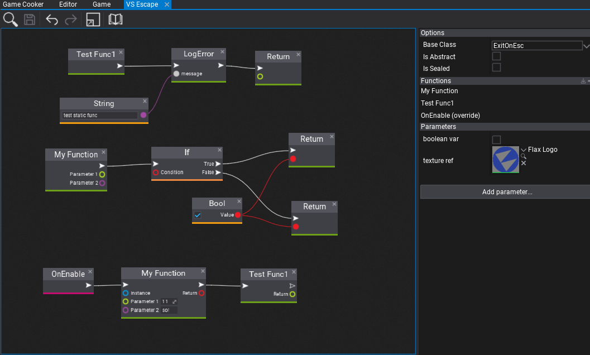

Flax Engine supports fully Visual Scripting with lots of great features such as: hot-reloading, full-API access, debugging, Visject Surface UI, and more. In general, Visual Scriptng offers more **robust development** for rapid prototyping while mainting solid performance.

Follow this documentation section to learn how to create your own visual scripts and use them in a game. Also, if you see any code examples in the *Flax Documentation* that are written in C# you can similarly use them in visual scripts since the engine uses the same API in all languages.

## How to create Visual Script?

### New Visual Script asset

**Visual Script** is an in-build binary asset that contains a graph with visual script nodes, properties and metadata. This graph is processed and executed at runtime by the engine. To create new Visual Script simply navigate to the *Content* directory, *right-click* and select option **New -> Visual Script**. Then specify it's name and confirm with *Enter*.

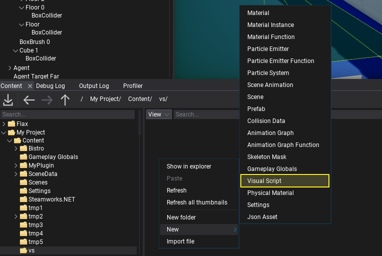

Now, editor allows you to pick the type of the visual script. You're asset will inherit from the specified base class. The default option is **Script** which fits in the most cases. You can also try extending Actor or any other type. Including custom game C++ and C# types for more robust scripting.

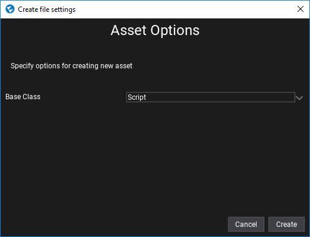

Confirm dialog with **Create** button and *double-click* on the asset icon to open the editor window.

### Visual Script editor window

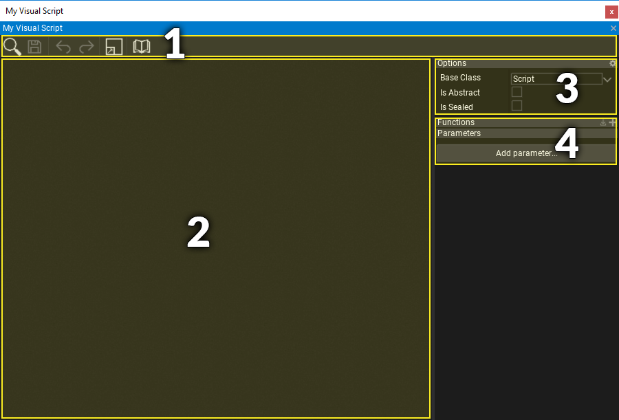

Visual Script editor window contains:
1) **Toolstrip** - utility buttons such as saving or undo control
2) **Visual Surface** - the nodes graph editor
3) **Class Properties** - visual script class settings
4) **Class Members** - visual script functions and properties.

### Navigation controls

Controls in the Visual Script Editor generally match the controls of other tools in the Flax Editor.

#### Mouse controls

| Control | Action |
|--------|--------|
| **RMB** drag on background  | Pan material nodes graph |
| **RMB** on background | Show node creation menu |
| **RMB** on node | Show node edit menu |
| **LMB** drag on background | Select nodes with rectangle tool |
| **LMB** on node | Select node |
| **Ctrl + LMB** on node | Toggle selection of node |
| **LMB** on node header | Move selected nodes |
| **Mouse Wheel** | Zoom in/out |

#### Keyboard controls

| Control | Action |
|--------|--------|
| **Ctrl + S** | Save the asset |
| **Ctrl + A** | Select all nodes |
| **Delete** | Delete selected nodes |

### Adding new node

In order to add a new node **right click** on a surface background and select a node type from a popup or type its name to find it. Visual Scripts can use engine and game types API just like C++ and C# scripts.
Also, when hovering the items with a mouse cursor the tooltip will show the documentation comments with details of every node.

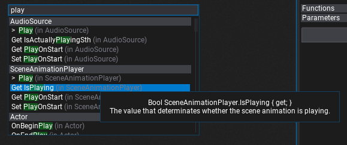

## Visual Scripting with Flax

Visual Scripts can override base class methods, have custom properties and methods full of visual code. To understand some basic concepts let's create a simple script that prints the custom message to the log when user clicks the mouse button.

Firstly, create a new Visual Script (like in the tutorial above). Then open it and override the **OnUpdate** method - it's called on active scripts during every game update so we can use it to update the game logic.

To override method you can use the special button on the script functions list in the *Class Members* panel, or type the function name in the context menu and select the one under *Method Overrides* category. Both ways are correct.

| Use button | Use context menu |
|--------|--------|
| 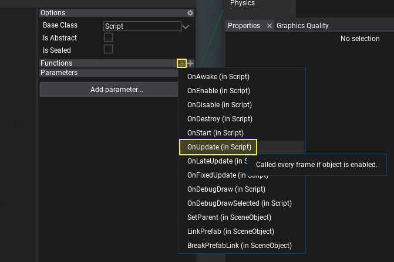 | 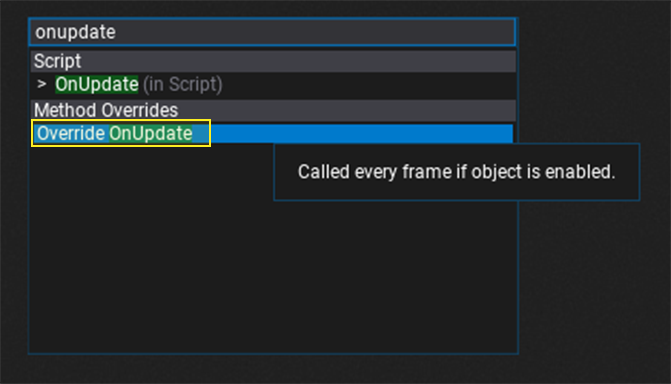 |

Now, we can use the function output impulse box to run custom script logic.

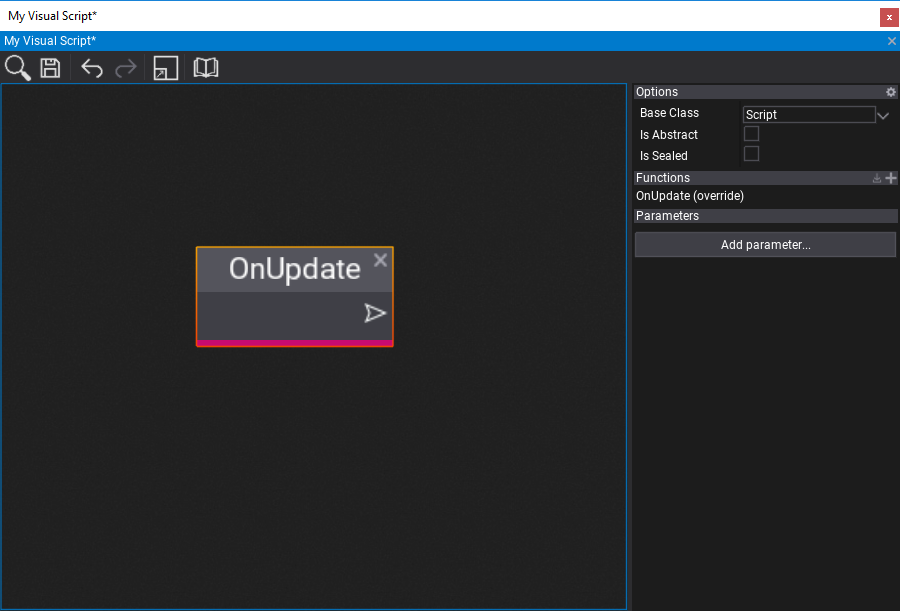

> [!Note]
> See that all functions in the script graph are listed under the *Functions* group inside the *Class Members* panel. You can use it to easily navigate to them or edit them.

Next step is to add **If** node that will use **GetMouseButton** method (from **Input** class) result as a *Condition*.
You can *right-click* on *GetMouseButton* node and press **Convert to pure method**. This will change the method to not use input and output signals, which is useful for typical getter nodes that just return the state value.
Set button to **Left** as input for *GetMouseButton* to check when that button goes down (is clicked by the user).


Then, let's add a property to the script with a message to print. To do this, press **Add parameter...** button and select the type of the parameter - use **String** in this example. Then *double-click* on the `New parameter` name label to rename it to **Message**.


Here you can specify the default message text we gonna print. It can be set also on instance of this script after adding it to the actor on the scene.

Finally, let's use **Log** method from *Debug* class that prints the custom message.

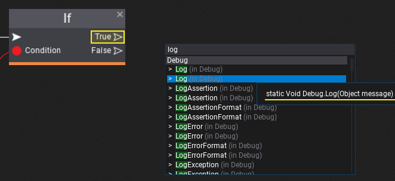

Then, connect it with *True* output of the *If* node that so the *Log* will be executed when user clicks the mouse button. Add **Get Message** node or drag and drop your new parameter into the surface to connect its value with the *message* input in the *Log* method.

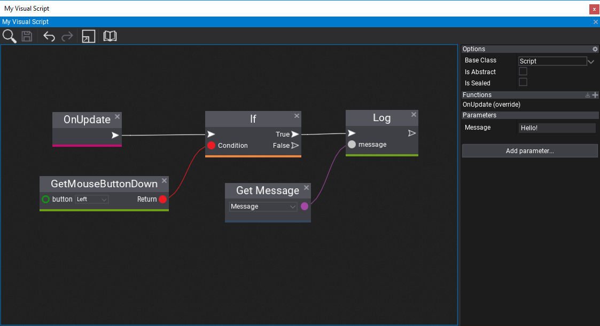

The last step is to add this script to an actor on the scene, set the Message property, and hit play to see the results! Every time user clicks the given mouse button it prints the custom log message.

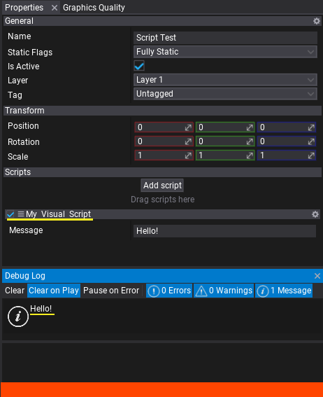

Feel free to start coding your game logic in Visual Scripting language!
Also, since Visual Scripting uses C# API of the engine you can use this [API reference](https://docs.flaxengine.com/api/FlaxEngine.html).

## Interop with C\+\+

To call Visual Script from C\+\+ you can do it as in the following example:

```cpp
#include "Engine/Content/Assets/VisualScript.h"
..
VisualScript* myScript = ..; // Assign it from editor or load asset manually
ScriptingObject* instance = nullptr; // Null for static methods, assign to object instance to call member function
Span<Variant> parameters; // Here you can pass parameters to the function
Variant result = VisualScripting::Invoke(myScript->FindMethod("My Func"), instance, parameters);
```
