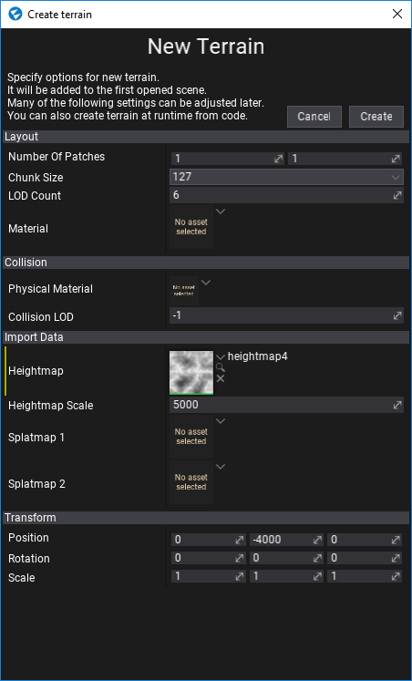

# Importing Terrain

Flax supports importing terrain from heightmap images. Using **Create terrain** dialog you can specify the input **Heightmap**, **Heightmap Scale**, and **Splatmaps**.

To learn more about importing terrain please see the related tutorial [here](tutorials/import-terrain.md).

## Heightmap

When importing `.RAW` files importer will hint to use *HdrRGBA* format without compression which gives better quality to terrain (also, RAW files needs to have the square size). If you import grayscale heightmap please ensure to use HDR format as well and disable compression to reduce artifacts in the generated terrain. You heightmap after importing won't be used by the engine so don't lock yourself to a certain resolution.

Flax supports **any texture size** as a heightmap but in general, it's better to provide high-quality images (although engine performs linear sampling during terrain generation to provide solid looking results). To calculate the best heightmap size use patches amount and chunk size to solve this equation: `HeightmapSize = NumberOfPatches * ChunkSize + 1`. So if you have square of 4x4 patches, each chunk has 127 size then the heightmap size should be `HeightmapSize = 4x4 * 127 + 1 = 509x509`. This non-conventional size is a result of internal engine optimization that packs the patch heightmap into square textures power of two size). Internal format for the terrain heightmap is `R8G8B8A8_UNorm` and uses `RG` channels for 16-bit height packing and `BA` channels for the per-vertex normal vector.

Terrain generator uses only Red channel for the heightmap and applies the custom **Heightmap Scale** to convert samples from the range [0-1] into the world units. The default scale **20,000** provides solid looking result however you can adjust it as you need. It's better to scale terrain height using this slider rather than applying non-uniform scale on Y-axis (this method reduces normals quality and may introduce lighting issues).

## Splatmaps

Flax supports 8 separate layer weights stored in 1 or 2 textures (depending on patch usage). It's better to use only layers 1-4 because then terrain will allocate only one splatmap per patch. Each splatmap texture channel contains 4 independent blending layers that can be sampled in terrain materials. Internally splatmaps match the patch heightmap dimensions and also use `R8G8B8A8_UNorm` format for layer wights storage (32-bit per vertex).
