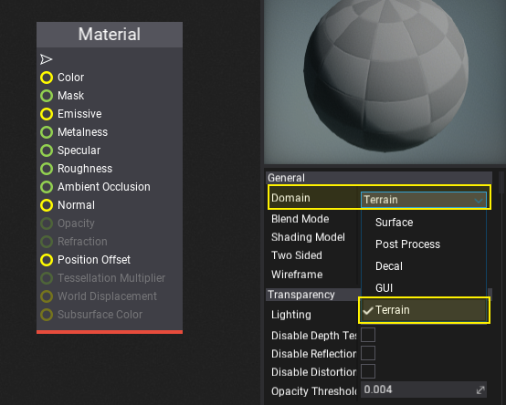
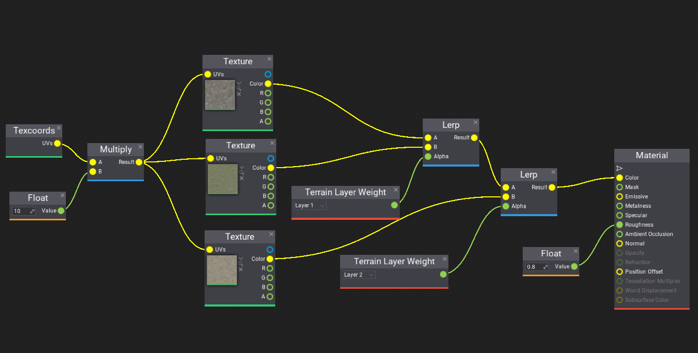
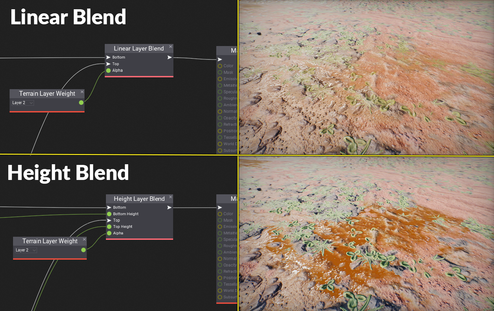

# Terrain Materials

Terrain uses a dedicated shader type for geometry rendering. It's more optimized and focused on performant landscape rendering with seamless Continous LOD support and material layers blending.

Terrain materials are similar to **Surface** materials with features like a deferred pipeline, full PBR and tessellation support. However, instead of processing model meshes geometry triangles they use precreated flat chunk grids and move uniform grid vertices based on terrain heightmap. All math is done in a Vertex Shader at low-cost.

To learn more about creating and using terrain materials please see the related tutorial [here](tutorials/terrain-material.md).

## Terrain Domain

To change your material into terrain-capable material just modify its domain to **Terrain**.

Then you can use terrain layer weights and terrain holes mask node to implement specific features.

## Terrain Layers

One of the common techniques when creating terrain material shaders is to use **layers**. Each layer can be a separate material or a material function (eg. with additional height output). Then you can easily blend those layers to produce final surface properties.
