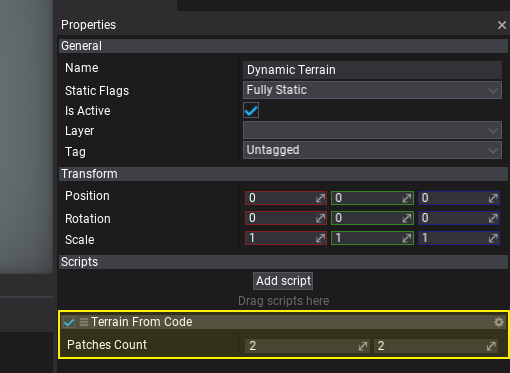
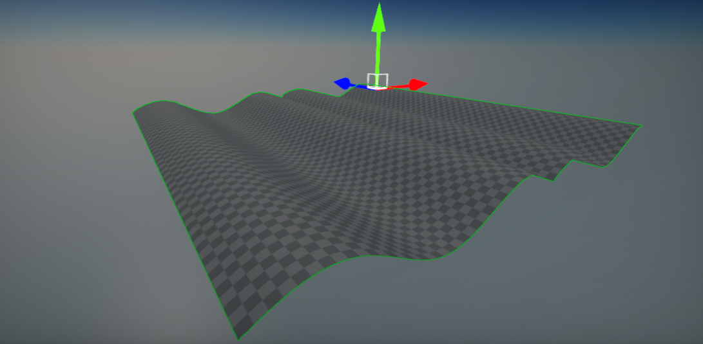

# HOWTO: Create terrain from code

In this tutorial, you will learn how to create terrain from code at-runtime. This technique can be used to implement using terrain in games that generate the landscape at runtime (eg. RTS games).

> [!Note]
> To support cooking collision for heightfield collider at runtime you must enable option **Support Cooking At Runtime** in Physics Settings.

## 1. Create new script

You can use [this tutorial](../../scripting/new-script.md) to learn how to do it.

## 2. Implement terrain generator

Write the following code to implement example terrain generator.

```cs
using System;
using System.Threading.Tasks;
using FlaxEngine;

public class TerrainFromCode : Script
{
    private FlaxEngine.Terrain _terrain;

    [Limit(1, 10), Tooltip("Terrain patches count (in each direction on XZ plane).")]
    public Int2 PatchesCount = new Int2(2, 2);

    private void Start()
    {
        // Create new dynamic terrain actor and add it to the scene
        _terrain = FlaxEngine.Terrain.New();
        _terrain.HideFlags = HideFlags.DontSave;
        _terrain.Name = "My Terrain";
        _terrain.Setup();
        _terrain.Parent = Actor;

        // Generate terrain using the async task to prevent game stalls
        // You can also use C# thread to perform this work
        // Your game can display progress bar or loading screen while terrain is being generated
        Task.Run(new Action(GenerateTerrain));
    }

    private void GenerateTerrain()
    {
        var chunkSize = _terrain.ChunkSize;
        var heightMapSize = chunkSize * FlaxEngine.Terrain.PatchEdgeChunksCount + 1;
        var heightMapLength = heightMapSize * heightMapSize;
        var heightmap = new float[heightMapLength];

        for (int patchZ = 0; patchZ < PatchesCount.Y; patchZ++)
        {
            for (int patchX = 0; patchX < PatchesCount.X; patchX++)
            {
                // Generate heightmap (simple sine wave for example showcase)
                for (int z = 0; z < heightMapSize; z++)
                {
                    for (int x = 0; x < heightMapSize; x++)
                    {
                        heightmap[z * heightMapSize + x] = Mathf.Sin((float)x / chunkSize * Mathf.PiOverFour * 3.0f) * 3000.0f;
                    }
                }

                // Initialize patch (virtual)
                var patchCoord = new Int2(patchX, patchZ);
                _terrain.AddPatch(ref patchCoord);
                _terrain.SetupPatch(ref patchCoord, heightmap, null, true);
            }
        }
    }
}
```

## 3. Add script to scene

Drag and drop the script to empty actor or use *Properties* window and **Add script** button.



## 4. Test it in Play Mode

Press **Play** button on the toolbar or hit *F5* key and see the results. Terrain should quickly generate in a background. The following example uses *virtual* textures for terrain heightmap and splatmaps storage so it uses any I/O and terrain data will be stored in memory only. You can use it in your games that need to generate a terrain at runtime or in the editor.



