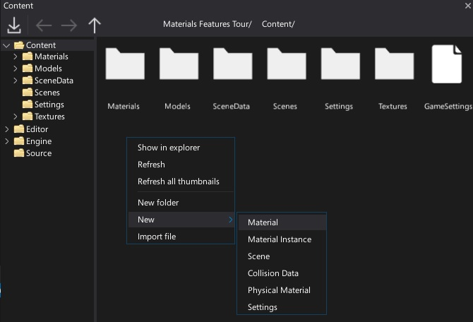
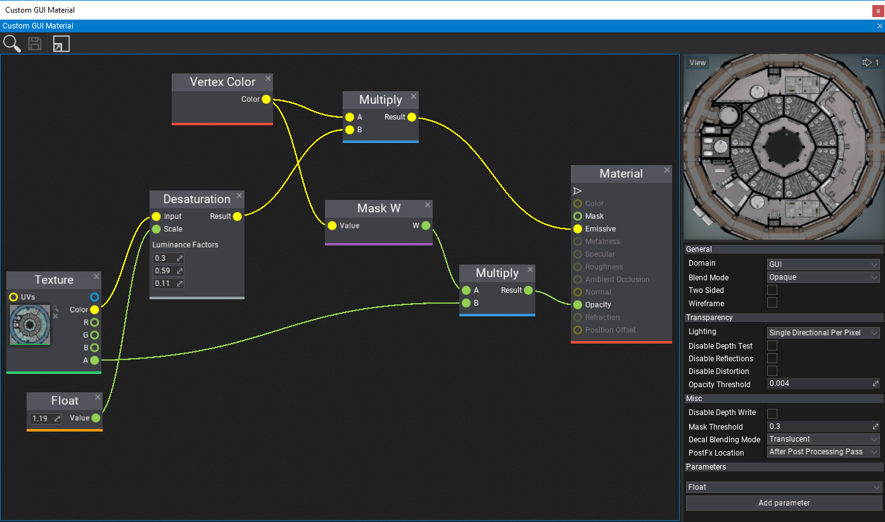
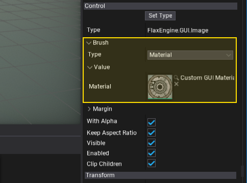
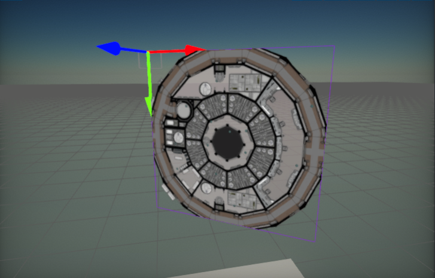

# HOWTO: Create Custom GUI Material

In this tutorial, you will learn how to create a GUI material that can be used to perform a custom rendering for UI components in your game. Follow these steps to prepare a simple material that uses a texture with a tint overlay and saturation control.

## 1. Create `Image`

The first step is to add [Image](../controls/image.md) control (with [UI Control](../control/index.md) and [UI Canvas](../canvas/index.md)).

## 2. Create new material asset

**Right click** in the **Content Window** and select option **New -> Material**. Then specify its name and confirm with Enter. Double-click on created asset and start editing material.

## 3. Set domain to `GUI`

Use the material properties panel and set the material **domain to GUI**. The generated material shader will be compatible with the GUI rendering pipeline.

## 4. Setup material graph

In this step you need to create a complete material. You can use the nodes network based on the following screenshot. To learn more about creating materials and using material parameters see the related documentation [here](../../graphics/materials/index.md).

## 5. Assign the material

The last step is to assign the created material asset to `Image` brush property. To do so, set the 

## 6. See the results!

Finally, you can see the results of your work. You can also change the constant values and texture to material parameters to use them from C# code or to override in [Material Instances](../../graphics/materials/instanced-materials/index.md).

