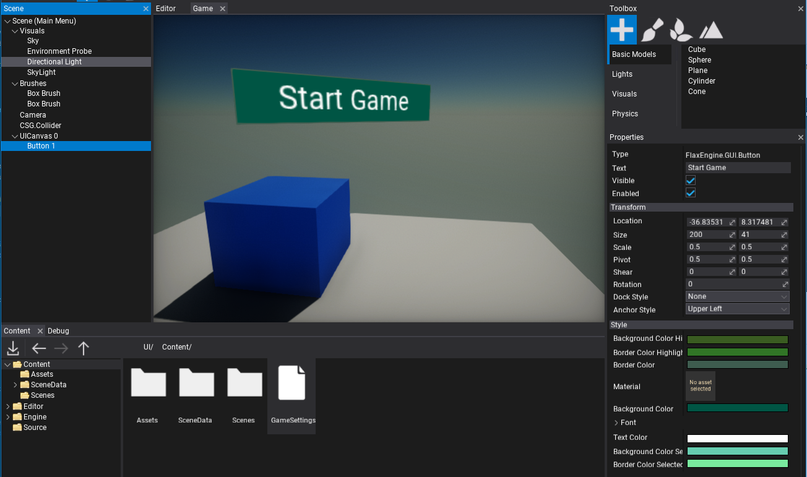
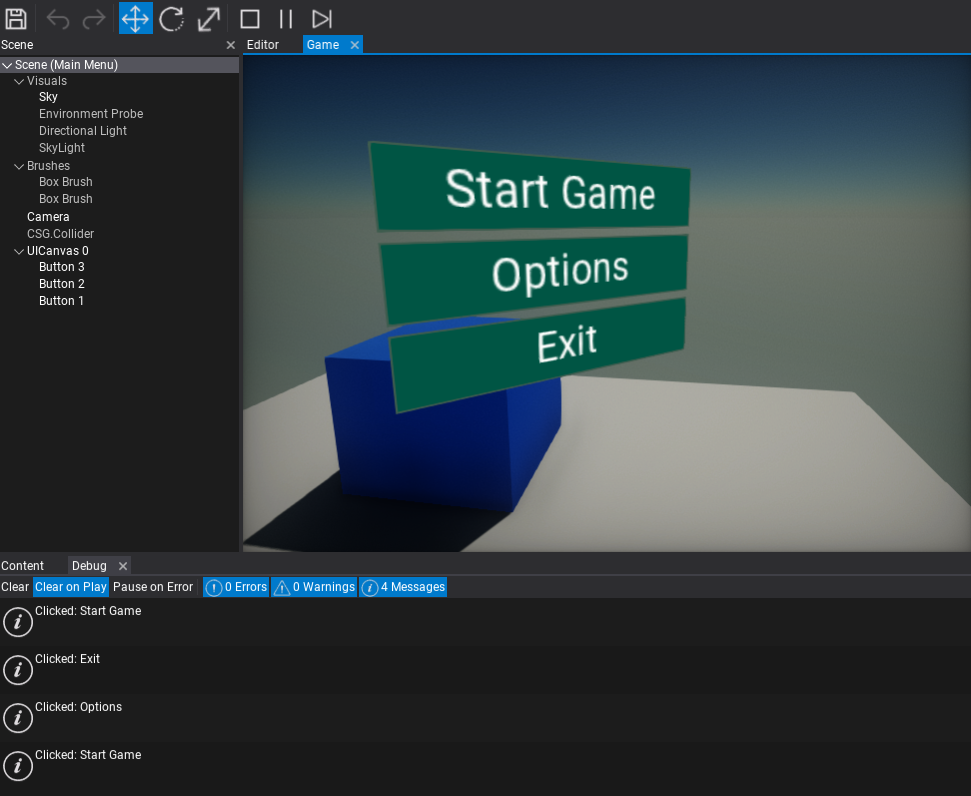

# HOWTO: Create a Main Menu

In this tutorial, you will learn how to create a Main Menu for your game.

## 1. Creating a `UICanvas`

The first step is to add a [UI Canvas](../canvas/index.md) actor which is used to render the GUI controls. It supports rendering the GUI in '*Screen Space*,' '*World Space*', and '*Camera Space*'. Use the option - **World Space** and place it somewhere in front of the camera.

To spawn a UI Canvas use a Toolbox window by dragging and dropping the **UI Canvas** from **GUI** section. Alternatively, you can use a Scene Tree window with a dedicated context menu for adding new scene objects.


## 2. Creating a `UIControl`

Follow the same steps as in the previous step, except now create [UI Control](../control/index.md) actor that represents a single GUI control. Add it as a child to the *UI Canvas* (as shown in a picture below).


## 3. Set control type to `Button`

For the GUI, use a `Button` control. To do so, select the spawned **UI Control** and click on the **Set Type** button to assign its type to **Button**. You can pick the item from the list or type to search for it.


Then the `UI Control` actor will link the created conrol to the GUI. Show the **Game** window tab to see the progress bar. You can adjust its properties using the panel below the *Set Type* button.



## 4. Create more buttons

Duplicate the created button with **Ctrl+D** or use **Shift + Mouse** with the transform gizmo to clone the selected button control. As a result prepare more menu options.


## 5. Create a `MainMenu` script

Add a new script named `MainMenu` that will handle the button click events. To learn more about creating and using scripts see [this tutorial](../../scripting/new-script.md).

## 6. Edit the script

Open the script file and write the following code:
//TODO: Update the script to separate the buttons methods, next commit.
```cs
using System.Collections.Generic;
using FlaxEngine;
using FlaxEngine.GUI;

public class MainMenu : Script
{
	[Tooltip("The menu buttons.")]
	public List<UIControl> Buttons;

	public override void OnStart()
	{
		if (Buttons == null || Buttons.Count == 0)
		{
			Debug.Log("No buttons");
			return;
		}

		foreach (var button in Buttons)
		{
			button.Get<Button>().ButtonClicked += OnButtonClicked;
		}
	}

	private void OnButtonClicked(Button button)
	{
		Debug.Log("Clicked: " + button.Text);
	}
}
```

## 7. Add the script to the actor

Now drag and drop the script to the actor in your scene (eg. *Canvas*).

## 8. Link the buttons to the script

Select the actor with the `MainMenu` script added, set the size of the `Buttons` list to 3, next drag and drop the `UIControl` actors with buttons to assign a reference to them for the script.


## 9. Test it out!

Finally, hit the **Play** button (or **F5** key) and test the script logic. After you click the menu button it will print its text into the *Debug* window. Use the callback to implement your game logic for starting new game or showing the game options to the user.



